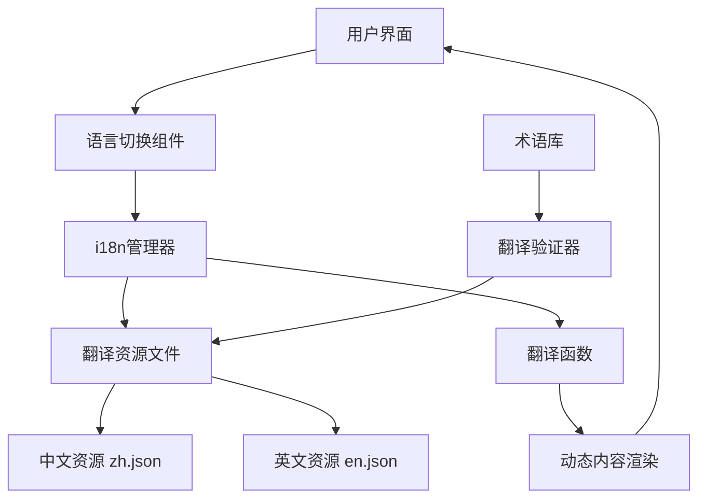

## 产品概述

全面修复现有翻译系统，解决当前多语言支持中存在的翻译错误、语言切换失效、内容缺失和显示异常等问题，确保所有页面内容都能正确显示中英文版本。

## 核心功能

- 修正关键术语翻译错误，如"节豆日粮解决方案"正确翻译为"Soybean-Reduced Ration Solutions"
- 完善语言切换机制，确保所有内容都能跟随语言设置同步切换
- 补全缺失的英文翻译内容，实现全站双语覆盖
- 修复英文版页面显示异常，确保内容正确呈现
- 统一翻译标准和术语库，提升翻译质量一致性

## 技术栈

基于现有项目技术栈，重点关注国际化(i18n)相关组件和配置的优化完善。

## 系统架构

### 翻译系统架构



### 模块划分

- **翻译资源模块**: 管理中英文翻译文件，统一术语标准
- **语言切换模块**: 处理用户语言偏好设置和状态管理  
- **内容渲染模块**: 确保所有UI组件正确使用翻译函数
- **验证检查模块**: 检测缺失翻译和显示异常

### 数据流程

用户选择语言 → 更新全局语言状态 → 触发组件重新渲染 → 获取对应语言资源 → 显示翻译内容

## 实现细节

### 核心目录结构

针对现有项目的翻译修复，主要涉及以下文件：

```
project-root/
├── src/
│   ├── locales/
│   │   ├── zh.json          # 修复和完善中文翻译
│   │   └── en.json          # 修复和补全英文翻译
│   ├── components/
│   │   └── LanguageSwitch.tsx # 修复语言切换组件
│   └── utils/
│       └── i18n.ts          # 完善国际化配置
```

### 关键代码结构

**翻译资源接口**: 定义标准化的翻译资源数据结构，确保中英文键值对应关系正确，支持嵌套分组管理。

```typescript
interface TranslationResource {
  [key: string]: string | TranslationResource;
}

interface I18nConfig {
  zh: TranslationResource;
  en: TranslationResource;
  currentLang: 'zh' | 'en';
}
```

**语言切换服务**: 提供全局语言状态管理，处理语言切换逻辑，确保所有组件能够响应语言变更事件。

```typescript
class LanguageService {
  setLanguage(lang: 'zh' | 'en'): void { }
  getCurrentLanguage(): string { }
  translate(key: string, params?: object): string { }
}
```

### 技术实现方案

针对每个主要问题的解决策略：

1. **翻译错误修正**: 

- 问题: 术语翻译不准确
- 方案: 建立专业术语库，统一关键词汇翻译标准
- 步骤: 审查现有翻译→建立术语对照表→批量更正错误翻译

2. **语言切换失效**:

- 问题: 部分内容不响应语言切换
- 方案: 检查组件翻译函数调用，确保所有文本都通过i18n系统处理
- 步骤: 定位硬编码文本→替换为翻译函数→测试切换功能

3. **英文内容缺失**:

- 问题: 英文翻译文件不完整
- 方案: 全面补充英文翻译资源
- 步骤: 对比中英文资源文件→标识缺失项→补充翻译内容

4. **显示异常修复**:

- 问题: 英文版显示格式或内容错误
- 方案: 优化英文文本长度适配和布局调整
- 步骤: 识别显示问题→调整样式和布局→验证显示效果

### 集成要点

- 确保所有页面组件都正确调用翻译函数
- 统一翻译资源的键名规范，避免重复或冲突  
- 实现翻译资源的热重载，便于开发调试
- 添加翻译完整性检查，防止遗漏翻译项

## 代理扩展

### SubAgent

- **code-explorer**
- 用途: 全面扫描项目中的翻译相关文件和代码，识别所有需要修复的翻译问题
- 预期结果: 生成完整的翻译问题清单，包括错误翻译位置、缺失翻译项和硬编码文本位置