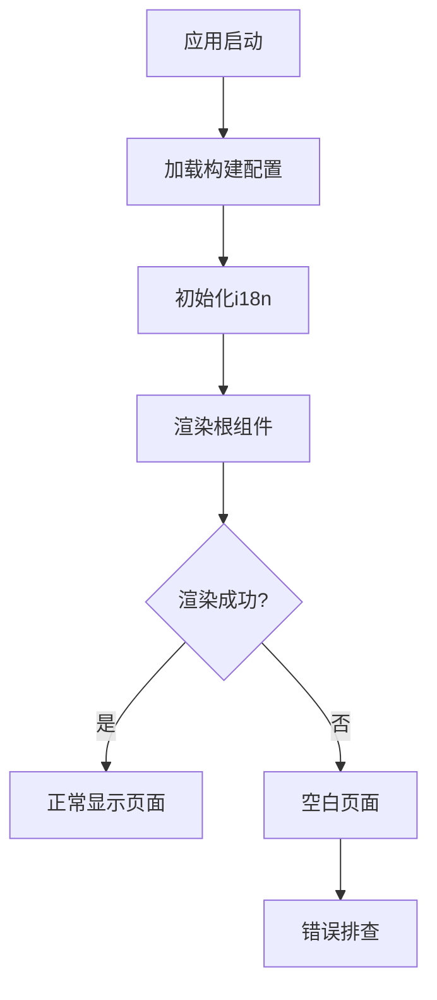

## 问题概述

mint_bio项目在yarn serve启动后出现页面空白渲染问题，需要诊断并修复i18n集成过程中可能引入的错误。

## 核心问题

- 页面完全空白，无任何内容显示
- 问题可能源于i18n集成配置错误
- 需要排查JavaScript运行时错误和配置问题
- 确保应用能够正常渲染和显示内容

## 问题诊断策略

### 系统架构分析

需要从以下层面进行问题排查：

- **前端渲染层**：检查DOM渲染和组件加载
- **配置层**：验证i18n和构建配置
- **依赖层**：确认依赖包正确安装和版本兼容

### 诊断模块划分

- **构建配置模块**：检查webpack、vite等构建工具配置
- **i18n配置模块**：验证国际化配置和资源文件
- **应用入口模块**：确认应用主入口文件和路由配置
- **依赖管理模块**：检查package.json和node_modules状态

### 数据流分析



## 实现细节

### 核心排查目录结构

```
mint_bio/
├── src/
│   ├── main.js/ts          # 应用入口文件
│   ├── i18n/               # 国际化配置目录
│   ├── components/         # 组件文件
│   └── locales/            # 语言资源文件
├── public/
│   └── index.html          # HTML模板
├── package.json            # 依赖配置
└── vite.config.js          # 构建配置
```

### 关键排查点

**控制台错误检查**：通过浏览器开发者工具Console面板查看JavaScript运行时错误，重点关注i18n初始化、组件加载和路由配置相关错误。

**网络请求分析**：检查Network面板确认静态资源（JS、CSS、图片）是否正确加载，验证API请求是否正常响应。

**i18n配置验证**：确认国际化配置文件语法正确，语言资源文件路径和格式符合要求，初始化逻辑没有阻塞渲染。

### 技术实现计划

针对空白页面问题的系统性排查：

1. **控制台错误分析**：识别JavaScript运行时错误和警告信息
2. **配置文件验证**：检查构建配置和i18n配置的正确性
3. **依赖完整性检查**：确认所有依赖包正确安装且版本兼容
4. **逐步回滚测试**：通过临时禁用i18n功能验证问题根源
5. **修复方案实施**：根据发现的问题应用相应的修复方案

### 集成点分析

- **构建工具集成**：确保webpack/vite正确处理i18n相关模块
- **Vue/React框架集成**：验证i18n插件与框架的正确集成
- **路由系统集成**：检查i18n与路由系统的兼容性
- **第三方库依赖**：确认i18n库与其他依赖的版本兼容性

## 技术考虑

### 性能优化

- 检查是否有循环依赖导致的加载阻塞
- 验证懒加载配置是否影响初始渲染
- 确认代码分割策略不会导致关键模块缺失

### 错误处理

- 实现i18n加载失败的降级方案
- 添加更详细的错误边界和日志记录
- 确保开发环境下有清晰的错误提示

### 兼容性保障

- 验证浏览器兼容性要求
- 检查polyfill配置是否完整
- 确认ES模块和CommonJS的混用不会导致问题

## 智能体扩展

### SubAgent

- **code-explorer**
- 目的：全面探索mint_bio项目代码库，定位空白页面问题的根本原因
- 预期结果：识别出i18n集成过程中的配置错误、代码问题或依赖冲突，为问题修复提供准确的方向