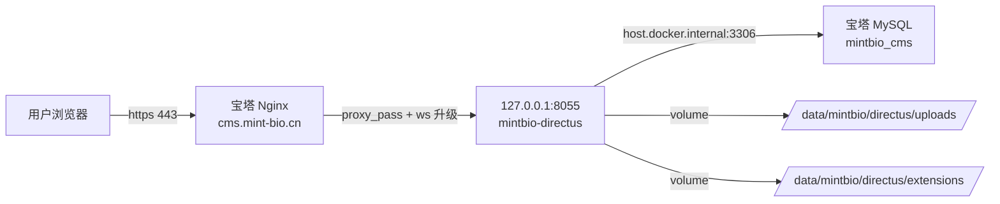

## User Requirements

继续推进 mint_bio 项目 Directus 后台的宝塔迁移，本轮收尾 Phase 2：把现在仅能 http 访问的 `cms.mint-bio.cn` 升级为 https，并同步消除 Directus 启动告警、收紧临时放宽的上传目录权限，让后台达到可交付运营使用的状态。

## Product Overview

- 目标环境：阿里云 + 宝塔面板 + Alibaba Cloud Linux 3.2104
- 目标站点：`cms.mint-bio.cn`（Directus 11.14.1 容器，容器名 `mintbio-directus`）
- 当前现状：宝塔反代已配通，http 可登录后台；HTTPS 未配、`SECRET` 不足 32 字节、`PUBLIC_URL` 非完整 URL、uploads/extensions 为临时 777 权限
- 本轮不做：公网 8055 端口收敛、Phase 3 CDN 接入、Phase 4 内容建模、任何前端源码改动

## Core Features

- 为 `cms.mint-bio.cn` 申请并启用宝塔 SSL，HTTP 自动 301 到 HTTPS
- 反代回配：Nginx 配置加上 `Upgrade` / `Connection` / `X-Forwarded-*` 头，保证 WebSocket 与 Directus 真实来源识别
- Compose 收口：`PUBLIC_URL=https://cms.mint-bio.cn`、`SECRET` 替换为 ≥32 字节强随机串
- 宿主机目录权限收紧：uploads / extensions 从 777 收敛到合适 uid 所属 + 755/644
- 验收：https 后台可登录、上传图片返回 `https://cms.mint-bio.cn/assets/...`、容器日志不再报 SECRET / PUBLIC_URL 告警
- 追踪文档同步：更新 `.codebuddy/plans/directus-bt-migration-execution.md` 的 Phase Checklist / Current Status / Execution Log / Next Actions，Phase 2 完全收官

## Tech Stack Selection

沿用既有技术栈，不引入新依赖：

- 容器：Docker 26.1.3 + Docker Compose v2.27.0
- 应用：Directus 11.14.1（官方镜像，默认以 uid 1000 `node` 用户运行）
- 反向代理 / SSL：宝塔面板内置 Nginx + 宝塔 SSL（Let's Encrypt 免费证书）
- 数据库：宝塔本地 MySQL 5.7.40（库 `mintbio_cms`，本轮不变更）

## Implementation Approach

采用"先不可逆度最低 → 最高"的推进顺序，每一步都有独立验证点，失败时可就地回退：

1. **证书先行**：在宝塔站点 `cms.mint-bio.cn` 上申请 Let's Encrypt 证书并开启"强制 HTTPS"。此步不改 Directus，只改站点 SSL 设置；若证书申请失败不影响现有 http 访问。
2. **反代回配 WebSocket & 转发头**：在现有反代配置基础上，补齐 `proxy_set_header Upgrade / Connection / Host / X-Real-IP / X-Forwarded-For / X-Forwarded-Proto` 与 `proxy_http_version 1.1`，并把 `client_max_body_size` 调到 `100M` 以容纳后台上传。reload Nginx 后用 `https://cms.mint-bio.cn` 验证。
3. **Compose 环境变量收口**：在服务器 `/srv/mintbio/directus/docker-compose.yml` 中：

- 将 `PUBLIC_URL` 从原值改为 `https://cms.mint-bio.cn`
- 用 `openssl rand -base64 48` 生成 ≥32 字节的新 `SECRET`（用户在服务器上自行生成，本文档不落明文）
- 改动前先备份 compose：`cp docker-compose.yml docker-compose.yml.bak.$(date +%s)`
- `docker compose up -d` 重建容器（不使用 `restart`，避免环境变量旧缓存）
- **注意**：替换 `SECRET` 会让所有已登录会话失效，需要重新登录；这是可接受的一次性影响

4. **目录权限收紧**：查询容器运行 uid（`docker exec mintbio-directus id`，Directus 官方镜像默认 `uid=1000 gid=1000 (node)`），对宿主机 `/data/mintbio/directus/{uploads,extensions}` 执行 `chown -R 1000:1000` + `find . -type d -exec chmod 755` + `find . -type f -exec chmod 644`。**fallback**：若 uid 不是 1000，则以实际 uid 为准；若出现权限冲突，退回 `chmod -R 775` + `chown` 保底方案。
5. **端到端验证 + 文档回写**：按验收清单跑完，再更新 `.codebuddy/plans/directus-bt-migration-execution.md`。

### 关键决策与权衡

- **为什么用 `up -d` 而不是 `restart`**：环境变量改动在 Directus 镜像里需要重建容器才能完全生效；`restart` 有时会命中旧 env 缓存。代价是容器会短暂停机（~10s），对当前运营影响可忽略。
- **为什么 SECRET 用 48 字节而不是刚好 32**：`openssl rand -base64 48` 产出 64 个可见字符，远超 Directus 要求的 32 字节下限，且避免 base32/hex 等编码在特殊字符上踩坑；一次到位不留隐患。
- **为什么先配证书再改 PUBLIC_URL**：反过来会出现 PUBLIC_URL 指向一个暂时不可用的 https 端点，导致上传的资源链接短暂 404。顺序正向做全程无断点。
- **为什么不本轮顺手收敛 8055**：用户明确本轮保留 8055 可访问作为兜底通道。一旦反代出问题，仍可用 `http://127.0.0.1:8055` 或 `http://<公网IP>:8055`（若安全组允许）兜底登录。

## Implementation Notes

- **敏感信息纪律**：`SECRET` 新值、`ADMIN_PASSWORD`、`DB_PASSWORD` 都不写入 `.codebuddy/plans/` 任何文档；计划文档只保留"已替换"的状态记录。
- **备份优先**：改 compose 前一定先 `cp` 备份；改 Nginx 反代配置前先复制一份 `/www/server/panel/vhost/nginx/cms.mint-bio.cn.conf.bak`（宝塔默认路径）。
- **验证最小闭环**：每一步都有独立可验证信号（curl 返回码、日志关键字、浏览器证书图标），不要把 4 步并成一步执行。
- **WebSocket 推荐配置**（Directus 官方建议）：
- `proxy_http_version 1.1`
- `proxy_set_header Upgrade $http_upgrade;`
- `proxy_set_header Connection "upgrade";`
- `proxy_read_timeout 86400;`（长连接不要过早断）
- **日志检查位点**：`docker logs mintbio-directus --tail 200` 重点观察是否还有 `SECRET` / `PUBLIC_URL` 相关 warning。
- **回滚路径**：
- SSL 出问题：宝塔关掉强制 HTTPS，站点回到 http
- compose 出问题：用 `.bak` 还原 + `docker compose up -d`
- 权限收紧出问题：临时 `chmod -R 777` 恢复放行 + 再排查 uid

## Architecture Design

本轮不涉及架构变更，只补齐 Phase 2 的边缘组件。组件关系保持：



本轮新增/调整点：

- `B` 新增 SSL 证书、强制 HTTPS、WebSocket 升级头
- `C` 的 `PUBLIC_URL` / `SECRET` 环境变量更新
- `E` / `F` 的宿主机权限从 777 收紧到 755/644 + uid 1000 owner

## Directory Structure

本轮只改服务器上的运行态文件，不改项目仓库代码。仓库内仅更新追踪文档。

```
项目仓库（Windows 端）
└── .codebuddy/plans/
    └── directus-bt-migration-execution.md   # [MODIFY] 同步更新 Current Status / Current Phase / Phase Checklist（Phase 2 所有子项勾选完成）/ Blockers / Next Actions / Execution Log；注意不要写入任何明文敏感值

服务器侧（仅记录，不在仓库里）
├── /srv/mintbio/directus/
│   ├── docker-compose.yml          # [MODIFY] PUBLIC_URL=https://cms.mint-bio.cn；SECRET 替换为 openssl rand -base64 48 生成的新串
│   └── docker-compose.yml.bak.*    # [NEW] 改动前备份
├── /www/server/panel/vhost/nginx/
│   └── cms.mint-bio.cn.conf        # [MODIFY] 反代块补齐 proxy_http_version 1.1 / Upgrade / Connection / X-Forwarded-* / client_max_body_size 100M；宝塔 SSL 会自动注入 443 server 块与 301 跳转
└── /data/mintbio/directus/
    ├── uploads/                    # [MODIFY] chown 1000:1000 + dir 755 / file 644
    └── extensions/                 # [MODIFY] 同上
```

## Key Code Structures

宝塔站点反代块的关键片段（在已有 `location / { proxy_pass http://127.0.0.1:8055; }` 基础上补齐）：

```
location / {
    proxy_pass http://127.0.0.1:8055;
    proxy_http_version 1.1;
    proxy_set_header Host              $host;
    proxy_set_header X-Real-IP         $remote_addr;
    proxy_set_header X-Forwarded-For   $proxy_add_x_forwarded_for;
    proxy_set_header X-Forwarded-Proto $scheme;
    proxy_set_header Upgrade           $http_upgrade;
    proxy_set_header Connection        "upgrade";
    proxy_read_timeout 86400;
}
client_max_body_size 100M;
```

## Agent Extensions

### Skill

- **directus-bt-migration-coach**
- Purpose: 按既定迁移工作流推进 Phase 2 收官，保证每一步都有宝塔侧具体操作指引与回滚方案，并强制在每步后同步追踪文档
- Expected outcome: `.codebuddy/plans/directus-bt-migration-execution.md` 的 Phase 2 全部子项勾选完成，Execution Log 补齐本轮三条执行记录，Next Actions 推进到"8055 公网收敛 + Phase 3 CDN 接入"