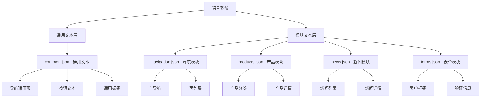

## 产品概览

优化现有多语言系统，采用混合方式重新组织语言资源结构，提升国际化文本管理的效率和可维护性。

## 核心功能

- 建立混合型语言资源组织架构，通用文本统一管理，特定文本模块化分组
- 完善中英文翻译资源，覆盖导航、产品介绍、新闻、表单等各功能模块
- 保持轻量级语言系统的设计理念，避免过度复杂化
- 提供统一的多语言文本获取接口，支持动态语言切换

## 技术选型

- 保持现有轻量级架构，基于JSON格式的语言文件
- 采用TypeScript提供类型安全的多语言接口
- 使用模块化导入策略，按需加载特定模块的语言资源

## 系统架构

### 混合语言资源架构

采用混合型语言资源组织方式，将语言文本分为两个层级：



### 模块划分

- **通用文本模块**: 管理跨模块使用的通用文本，如"了解更多"、"联系我们"等
- **导航模块**: 处理主导航、面包屑、侧边栏等导航相关文本
- **产品模块**: 管理产品介绍、分类、规格等产品相关文本
- **新闻模块**: 处理新闻列表、详情页、分类等新闻相关文本
- **表单模块**: 管理各类表单的标签、提示、验证信息等文本

### 数据流

用户请求文本 → 语言管理器检查通用文本 → 若未找到则查找对应模块文本 → 返回对应语言文本 → 组件渲染

## 实现细节

### 核心目录结构

基于现有项目，新增和修改的语言资源文件：

```
src/
├── i18n/
│   ├── common/
│   │   ├── zh-CN.json     # 通用中文文本
│   │   └── en-US.json     # 通用英文文本
│   ├── modules/
│   │   ├── navigation/
│   │   │   ├── zh-CN.json # 导航模块中文
│   │   │   └── en-US.json # 导航模块英文
│   │   ├── products/
│   │   │   ├── zh-CN.json # 产品模块中文
│   │   │   └── en-US.json # 产品模块英文
│   │   ├── news/
│   │   │   ├── zh-CN.json # 新闻模块中文
│   │   │   └── en-US.json # 新闻模块英文
│   │   └── forms/
│   │       ├── zh-CN.json # 表单模块中文
│   │       └── en-US.json # 表单模块英文
│   ├── types.ts           # 新增：语言文本类型定义
│   └── manager.ts         # 修改：混合语言管理器
```

### 关键代码结构

**LanguageResource接口**: 定义语言资源的核心数据结构，包含通用文本和模块化文本的类型约束，确保类型安全和代码提示功能。

```typescript
interface LanguageResource {
  common: CommonTexts;
  modules: {
    navigation: NavigationTexts;
    products: ProductTexts;
    news: NewsTexts;
    forms: FormTexts;
  };
}
```

**LanguageManager类**: 提供混合型语言资源管理功能，支持通用文本优先查找策略，模块化文本按需加载，以及动态语言切换功能。

```typescript
class LanguageManager {
  getText(key: string, module?: string): string;
  switchLanguage(locale: string): void;
  loadModule(moduleName: string): Promise<void>;
}
```

### 技术实现方案

针对每个功能模块的具体实现策略：

1. **混合资源加载机制**

- 解决方案：实现优先级查找策略，先查找通用文本，再查找模块文本
- 关键技术：TypeScript类型推断、JSON动态导入、缓存机制
- 实现步骤：建立资源索引→实现查找算法→添加缓存层→测试验证
- 测试策略：单元测试验证查找逻辑，集成测试验证模块加载

2. **文本资源整合**

- 解决方案：按功能模块分类整合现有文本，补充缺失的中英文翻译
- 关键技术：JSON文件规范、文本分类标准、翻译一致性检查
- 实现步骤：分析现有文本→按模块分类→补充翻译→验证完整性
- 测试策略：自动化检查文本完整性，人工review翻译质量

3. **类型安全保障**

- 解决方案：使用TypeScript严格类型定义，确保编译时文本键值检查
- 关键技术：TypeScript接口定义、字符串字面量类型、类型推导
- 实现步骤：定义文本类型→生成类型文件→集成到管理器→测试类型检查
- 测试策略：TypeScript编译检查，IDE智能提示验证

### 集成要点

- 与现有组件的集成：通过统一的useTranslation hook提供文本获取接口
- 性能优化：实现按需加载和文本缓存，避免一次性加载所有语言资源
- 开发体验：提供完整的TypeScript类型支持和IDE智能提示

## 代理扩展

### SubAgent

- **code-explorer**
- 用途：分析现有代码库中的语言系统结构，识别当前文本分布和使用模式
- 预期结果：生成现有语言文件清单和文本使用分析报告，为重构提供基础数据