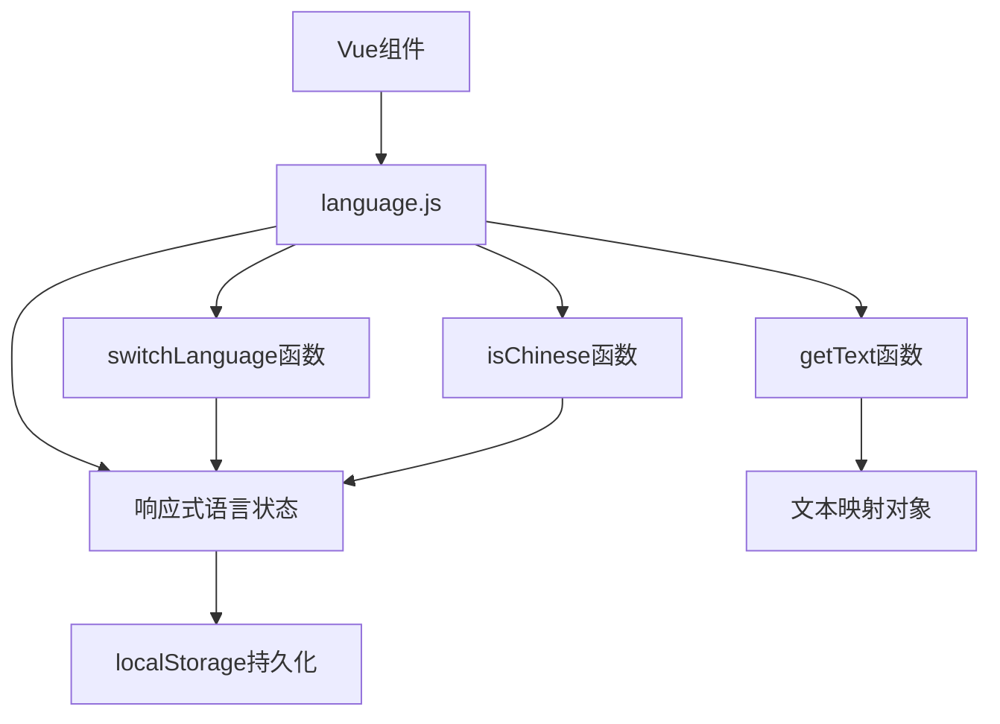

## 产品概述

修复空的 language.js 文件，重建完整的语言切换系统，解决 getText 函数未定义错误，恢复应用的多语言功能。

## 核心功能

- 重建 getText 文本映射函数，支持中英文文本获取
- 实现 switchLanguage 语言切换函数
- 添加 isChinese 语言判断函数
- 提供响应式语言状态管理
- 修复页面渲染错误，恢复正常的多语言显示

## 技术栈选择

基于现有项目的 Vue.js 框架，使用 JavaScript 重建语言工具系统。

## 系统架构



## 模块划分

- **语言状态模块**: 响应式的语言状态管理，支持中英文切换
- **文本映射模块**: getText 函数实现，根据当前语言返回对应文本
- **语言切换模块**: switchLanguage 函数实现，处理语言切换逻辑
- **工具函数模块**: isChinese 等辅助判断函数

## 数据流

用户触发语言切换 → switchLanguage 更新状态 → localStorage 持久化 → 组件重新渲染 → getText 获取新语言文本

## 实现细节

### 核心目录结构

```
src/
└── utils/
    └── language.js     # 重建完整的语言工具系统
```

### 关键代码结构

**语言状态管理**: 使用 Vue 的响应式系统管理当前语言状态，支持组件自动更新。

```javascript
// 响应式语言状态
import { ref } from 'vue'
const currentLanguage = ref('zh')
```

**getText 文本映射函数**: 核心文本获取函数，根据 key 和当前语言返回对应文本。

```javascript
function getText(key) {
  const textMap = {
    zh: { /* 中文文本映射 */ },
    en: { /* 英文文本映射 */ }
  }
  return textMap[currentLanguage.value]?.[key] || key
}
```

### 技术实现方案

1. **状态恢复**: 重建响应式语言状态管理，确保组件能正确响应语言变化
2. **函数重构**: 实现完整的 getText、switchLanguage、isChinese 函数
3. **持久化**: 集成 localStorage 存储语言偏好设置
4. **错误处理**: 添加容错机制，避免文本key不存在时的错误

### 集成要点

- 确保与现有 Vue 组件的兼容性
- 保持原有的 API 接口不变
- 支持热重载和动态语言切换

## 智能体扩展

### SubAgent

- **code-explorer**
- 目的: 探索项目中语言系统的使用情况，了解现有组件如何调用 getText 等函数
- 预期结果: 获取完整的语言系统使用模式，确保重建的系统与现有代码完全兼容