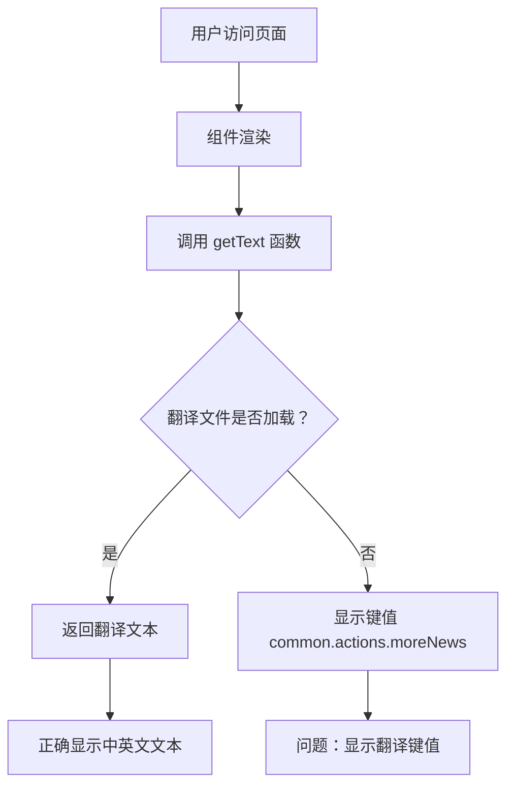

## 产品概述

修复前端国际化翻译显示问题，确保"更多动态"按钮能够正确显示中文和英文文本，而不是显示翻译键值。

## 核心功能

- 修复翻译键值 `common.actions.moreNews` 的显示问题
- 确保中英文环境下按钮文本正确显示
- 完善 i18n 模块化翻译文件的加载机制
- 验证翻译功能在不同语言环境下的正常工作

## 技术栈

基于现有项目的前端技术栈进行修复，主要涉及：

- 国际化(i18n)翻译系统
- getText 函数调用机制
- syncLanguageResources 资源同步

## 技术架构

### 问题分析

根据用户反馈，问题核心在于 getText 函数无法正确访问新添加的 i18n 模块化翻译文件，导致显示翻译键值而非实际文本。

### 解决方案

有两种技术方案：

1. **方案一**：将缺失的翻译键值添加到 syncLanguageResources 中
2. **方案二**：修改 getText 函数的调用方式，使其能够访问模块化翻译文件

### 数据流



## 实现细节

### 核心目录结构

```
project-root/
├── src/
│   ├── i18n/
│   │   ├── zh-CN/          # 中文翻译文件
│   │   │   └── common.js   # 需要检查/添加的文件
│   │   └── en-US/          # 英文翻译文件
│   │       └── common.js   # 需要检查/添加的文件
│   ├── utils/
│   │   └── i18n.js         # getText 函数实现
│   └── components/
│       └── HomePage/       # 包含"更多动态"按钮的组件
```

### 关键代码结构

**翻译文件结构**：定义多语言文本映射，确保 common.actions.moreNews 键值在所有支持的语言文件中都有对应的翻译文本。

```javascript
// i18n/zh-CN/common.js
export default {
  actions: {
    moreNews: '更多动态'
  }
}
```

**getText 函数**：负责根据当前语言环境获取对应的翻译文本，需要确保能够正确加载和访问所有模块化翻译文件。

```javascript
// utils/i18n.js
function getText(key) {
  // 需要修复的核心逻辑
  return translationData[key] || key;
}
```

### 技术实现方案

1. **问题定位**：检查 common.actions.moreNews 键值在翻译文件中的定义
2. **资源同步**：确保翻译文件正确加载到 syncLanguageResources 中
3. **函数调用**：验证 getText 函数能够访问模块化翻译文件
4. **测试验证**：在中英文环境下验证修复效果

### 集成要点

- 翻译文件必须正确导出和加载
- syncLanguageResources 需要包含所有必要的翻译模块
- getText 函数调用时需要正确的上下文环境
- 组件渲染时需要正确传递语言参数

## Agent Extensions

### SubAgent

- **code-explorer**
- 目的：搜索项目中的 i18n 翻译文件、getText 函数实现和相关组件，定位问题根源
- 预期结果：找到翻译文件结构、getText 函数实现和"更多动态"按钮的具体位置，分析翻译加载机制