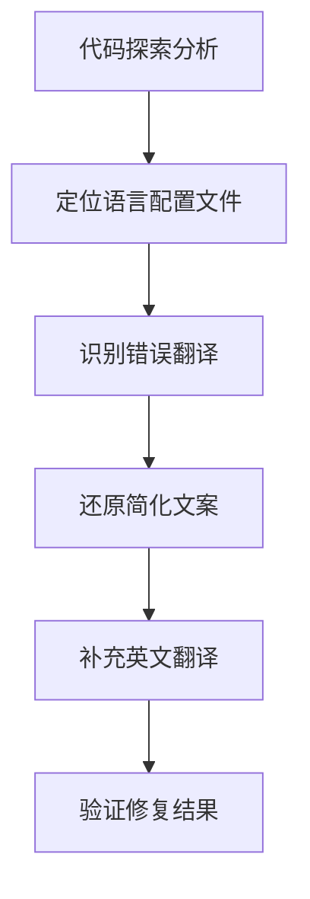

## 产品概述

修复mint_bio项目中语言系统的翻译错误，确保中英文内容的准确性和完整性。

## 核心功能

- 还原被错误简化的产品子页签中文名称
- 补充缺失的英文翻译内容
- 修复首页及其他页面的语言切换功能
- 确保中英文内容对应关系正确

## 技术栈选择

- 基于现有项目架构进行修复
- 保持现有的国际化(i18n)实现方案
- 使用现有的语言配置文件格式

## 系统架构

### 现有项目分析

通过代码探索分析当前语言系统实现方式：

- 定位语言配置文件位置和结构
- 分析语言切换逻辑实现
- 识别被错误修改的文案位置

### 数据流

## 实施细节

### 核心修复内容

1. **产品子页签名称还原**

- "新材料" → "生物降解新材料"
- "氨基酸" → "生物合成氨基酸"  
- "虎杖" → "节豆粮解决方案"

2. **英文翻译补充**

- 为所有中文内容提供对应的英文翻译
- 确保首页内容正确切换到英文

### 技术实现计划

1. **问题定位**: 使用代码探索工具全面分析项目结构，定位语言配置文件和翻译错误
2. **内容还原**: 严格按照用户要求还原被简化的中文文案
3. **翻译补充**: 为缺失英文翻译的内容添加准确的英文对应版本
4. **功能验证**: 测试语言切换功能确保修复效果

### 集成要点

- 保持现有项目的目录结构和代码组织方式
- 遵循现有的国际化实现规范
- 确保修改不影响其他功能模块

## 代理扩展

### SubAgent

- **code-explorer**
- 目的: 全面分析mint_bio项目结构，定位语言配置文件、翻译错误和相关组件
- 预期结果: 获得完整的项目语言系统实现分析，包括配置文件位置、错误文案位置和翻译缺失情况