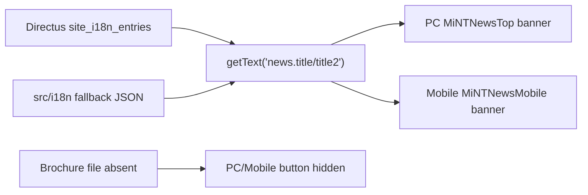

# MiNTNews Title And Brochure Button Update

## name

mint-news-title-brochure-update_20260531

## overview

Update the `/mintNews` page banner title from "发展 & 动态" to "元素驱动 & 进行时", hide the mobile-only brand brochure button, and document how to restore brochure downloads once a real file exists.

## todos

- [x] Confirm existing PC/Mobile MiNTNews title and brochure button behavior.
- [x] Update Directus fixed copy for `news.title` and `news.title2`, incrementing `site_i18n_settings.content_version`.
- [x] Sync local fallback i18n values for `news.title` and `news.title2`.
- [x] Hide the mobile MiNTNews brochure button while preserving the `news.downloadBrochure` key.
- [x] Add operator/developer documentation for restoring brochure downloads later.
- [x] Validate with dry-run/apply output, build, and search checks.
- [x] Fix PC banner title layout after long title caused clipping.
- [x] Add one shared PC/mobile feature switch for the brand brochure button.
- [x] Validate that both PC and mobile read the same switch and remain hidden by default.

## User Requirements

- `/mintNews` PC and mobile banner title should read "元素驱动 & 进行时".
- The existing PC brochure button stays hidden.
- The mobile brochure button must also be hidden.
- Future maintainers need clear instructions for enabling the button and downloading a real handbook file.
- Navigation text remains "发展动态"; only the page banner title changes.
- The orange `&` visual separator remains.

## Product Overview

The MiNTNews page is the website news list entry. Static page labels are resolved through `getText`, with Directus `site_i18n_entries` as the operational source and local JSON files as emergency fallback.

## Core Features

- Fixed copy update: `news.title = 元素驱动`, `news.title2 = 进行时`.
- Mobile brochure button hidden to match desktop.
- Documentation explains the future recovery path without exposing a dead download affordance today.

## Tech Stack Selection

- Vue single file components for page rendering.
- Directus REST API for runtime fixed copy.
- Local JSON fallback under `src/i18n/`.
- Markdown documentation under `doc/operations/`.

## Implementation Approach

- Add a small Directus update script that targets only `news.title` and `news.title2`, supports dry-run by default, and applies only with `--apply`.
- Edit `src/pages/MiNTNewsMobile/MiNTNewsMobile.vue` to wrap the button markup in a Vue comment, mirroring the desktop hidden-button pattern.
- Update `src/i18n/zh-CN.json` and `src/i18n/en-US.json` fallback values to the same Chinese text; do not invent English copy.
- Append a brochure recovery section to `doc/operations/directus-i18n-guide.md`.

## Implementation Notes

- Do not change `nav.news`; the site navigation continues to say "发展动态".
- Do not add a placeholder PDF or broken download URL.
- Preserve `news.downloadBrochure` for future reuse.
- PC code already has the brochure button commented out.
- PC banner title must not rely on the original short-copy fixed width; center-align the title, `&`, and subtitle within the 1728px banner container.
- PC title should preserve the original composition: the title text stays on one line and the orange `&` remains lower than the title, with only its horizontal position adjusted.

## Architecture Design

## Directory Structure

- `scripts/update-mint-news-title.mjs`: targeted Directus updater.
- `src/pages/MiNTNewsMobile/MiNTNewsMobile.vue`: mobile brochure button visibility.
- `src/components/MiNTNews/MiNTNewsTop.vue`: PC banner title alignment and clipping fix.
- `src/i18n/zh-CN.json`, `src/i18n/en-US.json`: fallback title values.
- `doc/operations/brand-brochure-download-guide.md`: future brochure recovery instructions.

## Key Code Structures

- Directus entries: `site_i18n_entries.key_path in ["news.title", "news.title2"]`.
- Runtime cache invalidation: `site_i18n_settings.content_version += 1` when changes are applied.
- Mobile hidden button: Vue comment keeps restore instructions near the original markup.

## Validation / Acceptance

- Directus dry-run reports only `news.title` and/or `news.title2` as create/update candidates.
- Directus apply increments `content_version` only if changes are needed.
- `/mintNews` title resolves to "元素驱动 & 进行时" after runtime cache refresh.
- Mobile `/mintNews` no longer renders the brand brochure button.
- `npm run build` succeeds.
- Search confirms no visible active MiNTNews brochure button remains.
- PC `/mintNews` title no longer clips "进行时" after the title copy changes to "元素驱动 & 进行时".

## Execution Log

- 2026-06-07: Follow-up requirement: mobile MiNTNews hero title wrapped `news.title2` incorrectly, splitting the final character of "jinxing shi" onto its own line. Design: keep Directus/i18n unchanged, split the mobile title into three visual spans (`news.title`, orange `&`, `news.title2`), and use a centered grid with `word-break: keep-all` so the third segment remains atomic on mobile. Acceptance: source confirms no `&nbsp;` concatenated title remains in `MiNTNewsMobile.vue`; build must pass.
- 2026-06-07: Implemented the mobile title structure/CSS in `src/pages/MiNTNewsMobile/MiNTNewsMobile.vue`; `npm.cmd run build` passed with existing asset-size, Browserslist, and `::v-deep` warnings. Local preview smoke check on port 8091 could not start because PowerShell `Start-Process` hit the environment `Path/PATH` duplicate-key error before the dev server launched.
- 2026-06-07: Follow-up requirement: mobile brand brochure button must use the same visibility switch as PC. Design: add `src/config/brandBrochure.js` with `SHOW_BRAND_BROCHURE_DOWNLOAD = false`, import it in both PC and mobile MiNTNews banner components, and keep Directus/i18n unchanged because no visible copy changes are needed.
- 2026-06-07: Implemented shared switch in PC and mobile MiNTNews banners; targeted search confirmed both components reference `SHOW_BRAND_BROCHURE_DOWNLOAD`; `npm.cmd run build` passed with existing asset-size and `::v-deep` warnings.
- 2026-06-07: Follow-up from BioIntelligent page check: source search found no BioIntelligent-specific active brochure DOM; the remaining page-adjacent brochure block is the shared desktop Footer. Converted Footer's brochure block from a commented placeholder to `v-if="SHOW_BRAND_BROCHURE_DOWNLOAD"` using `news.downloadBrochure`, so BioIntelligent's footer area is governed by the same switch and remains hidden by default.
- 2026-06-01: Directus dry-run reported `current_content_version=35`, `next_content_version=36`, `updates=2`, keys `news.title` and `news.title2`.
- 2026-06-01: Directus apply completed and incremented `content_version` to `36`.
- 2026-06-01: Post-apply dry-run reported `updates=0`, `creates=0`, `next_content_version=36`.
- 2026-06-01: Local fallback JSON parse passed for `src/i18n/zh-CN.json` and `src/i18n/en-US.json`; `nav.news` remains unchanged.
- 2026-06-01: `npm.cmd run build` passed with existing webpack asset-size and `::v-deep` deprecation warnings.
- 2026-06-01: Search confirmed MiNTNews brochure buttons are present only in commented code/documentation/fallback keys; no active mobile button remains.
- 2026-06-01: User screenshot showed PC title clipping after the longer copy; updated `MiNTNewsTop.vue` to center the title, orange `&`, and subtitle instead of using the old 380px short-title box.
- 2026-06-01: Follow-up correction: reverted the one-row flex experiment because the desired design keeps `&` lower than the title. Preserved the original separate `&` layout and tuned its horizontal position to `left: 52.5%`, between the earlier too-left and too-right placements.
