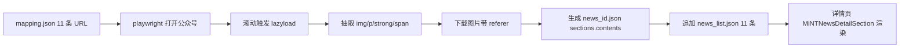

## Product Overview

mint_bio 官网第一阶段紧急显性问题整改（五一节前完成）。面向官网 PC + Mobile 双端，围绕"新闻完整还原、口径统一、产品改名、荣誉新增、模块删减、创始人头衔、英文下线"七项显性问题做闭环修复，保证对外形象与公司最新官方表述一致。

## Core Features

### 1. 新闻动态同步（11 篇公众号文章，完整详情页还原）

- 按现有 37 篇新闻数据规范（`public/data/news_<id>.json` + `sections[].contents[]` 块渲染），对 11 篇公众号文章做**完整详情页还原**，不做外链跳转、不加"阅读原文"按钮。
- 分类映射（用户已确认）：#MiNT 进行时（橙 #FF7200）8 条、#MiNT 产品力（蓝 #144BE1）3 条（生物降解笔材 / DIN CERTCO / PiX 中药地膜）。
- id 分配：`news_list.json` 头部插入 11 条，id = 38~48，按公众号发布日期倒序；保留现有 37 条不动。
- 首图使用公众号文章 cover，列表卡片沿用 `pic` 字段；详情页沿用 `headPic[]` / `footerPic[]` / `contents[]`。
- 点击行为复用现有 `router.push MiNTNewsDetail/:id`，无需改动列表点击 handler。
- PC 与 Mobile 复用同一份 `news_list.json` 与同一批详情 JSON。

### 2. 全站文案口径统一

- 5 个口径落点（首页 · 核心能力 · 卓越产品力；首页 Banner 产品板块；首页 · 生物智造 · 产品解决方案；Footer 产品板块；关于我们 · 企业概况）预留"文案对照表"占位，等用户补充精确对照表后按位逐点替换。
- Footer 产品板块先行落地：`nav.material` → "全生命周期低碳未来材料"、`nav.aminoAcid` → "绿色生物合成氨基酸"，节豆日粮保留。
- 英文版对应 i18n 按项目规则：`doc/zh-en/` 对照 docx 中无对应翻译的字段，保留中文原文，不自译。

### 3. PiX 产品命名全量替换

- 全站 PiX001~PiX005 / PiX 001~PiX 005 统一更名为：膜袋材料 / 3D 打印材料 / 注塑材料 / 地膜材料 / 纤维材料。
- 覆盖范围：i18n 两份主 JSON、`modules/*/zh-CN.json`、NewMaterial 两端页面、BioIntelligent 分块组件、FAQ 叙述文案、图片 alt 等；**不替换**公众号原标题/正文中的 PiX 字样（新闻 JSON 保留原文）。

### 4. 企业荣誉新增

- 落点：`关于我们 · 企业概况` 页的 `corpList` 数组小图墙（PC `src/pages/CorporateVision/index.vue` + Mobile `CorporateVisionMobile/index.vue`），当前 8 张 corp1~corp8.png。
- 新增 4 项：浙江省企业研究院 / 浙江省"科技新小龙" / 杭州市新雏鹰企业 / 杭州市准独角兽榜单企业（2023-2026）。
- 图片由 AI 参考现有 corp1~corp8.png 风格生成 corp9~corp12.png，落到 `src/assets/CorporateVision/`，接受一定风格瑕疵。

### 5. 功能模块删减

- 删除关于我们-发展动态 `MiNTNewsTop.vue` 中"下载品牌手册"按钮（PC+Mobile）；`downloadBrochure` i18n 键保留。
- 修改首页·生物智造·量产无忧卡片 `home.bioIntelligent.massProduction.desc`，删除"到 2025 年底产能 6 万吨"表述。

### 6. 创始人头衔更新

- 张科春主 title：`创始人&首席科学家` → `创始人&科学顾问委员会主席`（position/bio 保持不变）。
- 刘旻昊主 title：`董事长 & 联合创始人` → `联合创始人\n董事长&CEO`（两行显示，校内 position 字段保留）。
- PC + Mobile 同步；若原渲染不支持换行，追加 `white-space: pre-line` 样式或拆成两行字段。

### 7. 英文入口下线

- Header 与 MobileHeader 隐藏语言切换按钮（保留代码）。
- 路由 `beforeEach` 守卫：`/en`、`/en/*`、`?lang=en` 重定向到中文版对应页；`utils/language.js` 强制 `zh-CN`；`localStorage` 里 `en-US` 值清理为 `zh-CN`。
- 保留 en-US.json 与切换逻辑代码，便于后续英文版上线恢复。

## Tech Stack Selection

- Vue 3（script setup + options API 混用，现状维持）+ Vue Router
- 自研 i18n：`src/utils/language.js` + `src/i18n/{zh-CN,en-US}.json` + `src/i18n/modules/*`
- Element Plus（Footer 布局 `el-row / el-col`）
- Less / SCSS + PostCSS（px 转换，已 exclude `/public/`）
- 静态 JSON 数据：`public/data/news_list.json` + `public/data/news_<id>.json`（axios 拉取）
- Node.js 脚本（playwright + 本地 fs）用于批量抓取公众号图片与正文，仅开发期使用，不入运行时包。

## Implementation Approach

### 总体策略

分 8 条轨道推进，以"抓取→结构化→还原详情→列表接入→口径/产品/荣誉/模块同步"为主轴：

1. 第 0 步：建 OpenSpec 主计划 + subagent 精确定位落点
2. 并行：PiX 重命名、模块删减、创始人头衔、英文下线、荣誉 corp 数组追加（图片生成并行）
3. 主线（最重）：11 篇新闻抓取 → 拆块 → 生成 news_<id>.json → 追加 news_list.json
4. 最后：yarn serve 验收 + 更新 spec

### 关键技术决策

1. **新闻完整还原（用户纠正）**：采用"Node.js + playwright 抓取脚本"而非简单 fetch：

- 启动 chromium，逐一打开 11 个 mp.weixin.qq.com 链接
- `page.goto` 后滚动到底 + 等待图片 lazyload (`data-src` → `src`) 完成
- 从 DOM 按阅读顺序抽取节点：`` → pic 块；`<section>` / `<p>` 纯文本 → desc 块；包含 `<strong>` 或 color span 的段落 → strongText 块（HTML 片段，保留 `<span class='orange-text'>` 标记，匹配项目已有样式 `.orange-text/.blue-text/.green-text/.blue-green-text/.strong-text`）
- 用 `page.request` 或 `context.request`（带 referer `mp.weixin.qq.com`）下载所有图片，保存为 `src/assets/News/202604/news<id>_pic_<seq>.jpg`
- 产出 11 份 `news_<id>.json` 初稿；首图同时作为列表 `pic` 字段
- **保守策略**：默认所有段落用 `desc`（纯文本），只有公众号原文显著加粗/彩色/标红的句子才产出 `strongText` + `.orange-text`（项目主色），避免过度上色
- 脚本失败时降级：用 pdf / docx 等旁路抓取（由用户提供 PDF 或 docx 备份）

2. **抓取脚本落位**：放 `scripts/fetch-news/fetch.mjs` + `scripts/fetch-news/mapping.json`（11 个 URL + id + category + time 映射），不进 `src/`、不影响构建；`package.json` 仅加 `scripts.fetch-news` 开发命令。
3. **PiX 全量替换**：grep 先扫描定位 → 按文件精确替换，避免误伤新闻 JSON 里公众号原文。`news_list.json` 和 `news_<id>.json` 均排除在外。
4. **口径对照表占位**：5 个落点在 i18n key 上留 `// TODO: 口径对照` 注释（仅 Footer 两条先落），Vue 源码不动，等用户补对照表后一次性替换。
5. **英文路由兜底**：`router.beforeEach` 检测 `to.path` 命中 `/^\/en(\/|$)/` 或 `to.query.lang === 'en'` → 重写为去 `/en` 前缀和去 `lang=en` 查询的路径，调 `next({ ..., replace: true })`。同时 `utils/language.js` 硬编码 `currentLang='zh-CN'`，`localStorage.getItem('lang') === 'en-US'` 时覆写回 `zh-CN`。
6. **荣誉展示区**：`corpList` 追加 4 项；PC 用字符串路径 + `getImageUrl`，Mobile 用 `require('@/assets/CorporateVision/corpN.png')`，保持两端现有写法。
7. **创始人换行**：首选不动渲染逻辑，在 title 文本里插入 `\n`，样式层增加 `white-space: pre-line`；如现有元素未支持则就近加 style。

### 性能与稳定性

- 新闻列表一次加载 48 篇（<300KB），无需分页。
- 抓取脚本并发控制在 3，避免微信风控；失败重试 2 次；缺失图片记录到 `scripts/fetch-news/report.json` 便于人工补。
- 富文本段落数控制：每篇 `contents[]` 节点数 ≤ 30，避免详情页渲染开销。
- 路由守卫只在 `/en*` 命中时触发 redirect，无额外开销。

## Implementation Notes

- **i18n 翻译规则铁律**：新增中文字段（新产品名、新头衔、口径文案）在 `doc/zh-en/` 对照 docx 中无对应翻译时，`en-US.json` 中对应位置**保留中文原文**，不自译；对照缺失时立即停下告知用户。
- **双端同步**：所有 PC 改动必须在 `*Mobile` 组件中做等价改动；提交前 grep 复核 `HomeMobile / CorporateVisionMobile / MiNTNewsMobile / NewMaterialMobile / BioIntelligentMobile / FooterMobile / MobileHeader` 是否遗漏。
- **OpenSpec 主计划**：`.codebuddy/plans/website-phase1-urgent-fixes_20260423.md` 登记 8 条待办、对照表占位、11 篇抓取结果清单（每篇图片数、段落数、高亮位置）、验收清单。
- **不破坏现有行为**：
- 不改 `news_list.json` 现有 37 条；新增 11 条 schema 与现有保持一致（`id / title / time / pic / categorylabel / categorycolor / overviewtitle` + 可选 `category`）。
- 不删 `MiNTNewsTop.vue` 中 `downloadBrochure` i18n 键。
- 不改 `MiNTNewsDetailSection.vue` 等渲染组件逻辑，仅通过数据驱动还原内容。
- **日志与安全**：抓取脚本不写入任何凭据；日志仅记录 URL + id + 图片数 + 耗时；图片带 referer 下载，保存本地后不再依赖微信图床。
- **富文本样式保守使用**：默认 `desc`；`strongText` 仅用于公众号原文真正强调的句子，class 限定为 `orange-text/blue-text/green-text/blue-green-text/strong-text` 五种；禁止引入新 class。
- **git 状态兼容**：`src/main.js` / `src/utils/language.js` 已 modified，先 `git diff` 确认未提交改动与本次目标不冲突再叠加。

## Architecture Design

### 改动分层

```
数据层    public/data/news_list.json              追加 11 条
          public/data/news_38.json ~ news_48.json  11 份详情 JSON
          src/assets/News/202604/*.jpg             ~130 张抓取图

脚本层    scripts/fetch-news/fetch.mjs             playwright 抓取脚本
          scripts/fetch-news/mapping.json          URL/id/分类/日期映射
          scripts/fetch-news/report.json           抓取结果报告

i18n 层   src/i18n/zh-CN.json / en-US.json         头衔/产能/Footer 菜单/PiX 文案/企业概况
          src/i18n/modules/{navigation,pages,products}/*

组件层    src/components/MiNTNews/MiNTNewsTop.vue  删品牌手册按钮
          src/components/Header/ + MobileHeader/   隐藏语言切换
          src/pages/CorporateVision*/              荣誉 corpList 追加 + 头衔
          src/pages/NewMaterial*/                  PiX 改名
          src/components/BioIntelligent/           PiX 改名（Part3/Part6）

图片层    src/assets/CorporateVision/corp9~12.png  AI 生成 4 张荣誉图

路由/工具 src/router/index.js                      /en* 重定向守卫
          src/utils/language.js                    强制 zh-CN
          src/main.js                              语言初始化校验

计划文档  .codebuddy/plans/website-phase1-urgent-fixes_20260423.md
```

### 新闻还原流程



## Directory Structure

```
d:/UGit/mint_bio/
├── .codebuddy/plans/
│   └── website-phase1-urgent-fixes_20260423.md   # [NEW] OpenSpec 主计划：8 条 todo、11 篇抓取结果表、对照表占位、验收清单。
│
├── scripts/fetch-news/                            # [NEW-DIR] 仅开发期使用的抓取脚本，不入运行时。
│   ├── fetch.mjs                                  # [NEW] playwright 抓取脚本：逐篇 goto、滚动触发 lazyload、抽 DOM 结构化、带 referer 下载图片、产出 news_<id>.json。
│   ├── mapping.json                               # [NEW] 11 条 URL / id(38-48) / category / categorylabel / categorycolor / time（公众号发布日期倒序）映射表。
│   └── report.json                                # [NEW] 抓取结果报告：每篇图片数 / 段落数 / 失败原因。
│
├── public/data/
│   ├── news_list.json                             # [MODIFY] 头部追加 11 条（id=38~48），字段与现有 37 条一致（title/time/pic/categorylabel/categorycolor/overviewtitle/可选 category）。
│   ├── news_38.json                               # [NEW] 阿克苏棉花 详情 JSON（#MiNT 进行时）
│   ├── news_39.json                               # [NEW] PiX 浙江重点新材料示范（#MiNT 进行时）
│   ├── news_40.json                               # [NEW] 元素智造 415X 新兴产业集群（#MiNT 进行时）
│   ├── news_41.json                               # [NEW] 科技新小龙 & 企业研究院 双认定（#MiNT 进行时）
│   ├── news_42.json                               # [NEW] 生物降解笔材 × 制笔之乡（#MiNT 产品力）
│   ├── news_43.json                               # [NEW] PiX 3D 打印 × 蜜雪冰城降解奖杯（#MiNT 进行时）
│   ├── news_44.json                               # [NEW] 2026 年度招聘（#MiNT 进行时）
│   ├── news_45.json                               # [NEW] 媒体聚焦 - 刘旻昊访谈（#MiNT 进行时）
│   ├── news_46.json                               # [NEW] PiX 获 DIN CERTCO 认证（#MiNT 产品力）
│   ├── news_47.json                               # [NEW] 合成生物领域大会（#MiNT 进行时）
│   └── news_48.json                               # [NEW] PiX 全降解地膜 × 传统中药（#MiNT 产品力）
│
├── src/assets/News/202604/                         # [NEW-DIR] 11 篇图片批次目录，命名 news<id>_pic_<seq>.jpg / news<id>_head_<seq>.jpg。
│
├── src/i18n/
│   ├── zh-CN.json                                  # [MODIFY] (1) corporate.founders.zhang.title; (2) corporate.founders.liu.title + titleMobile; (3) home.bioIntelligent.massProduction.desc 去掉 6 万吨; (4) nav.material / nav.aminoAcid 改口径; (5) FAQ/案例中 PiX 00X 全量替换; (6) corporate.intro1~3 + home.sections.products 预留口径对照 TODO 占位。
│   └── en-US.json                                  # [MODIFY] 同步字段改动；未在 doc/zh-en/ 对照 docx 中出现的新字段保留中文原文。
│
├── src/i18n/modules/
│   ├── navigation/zh-CN.json                       # [MODIFY] products.materials / aminoAcids 口径统一。
│   ├── navigation/en-US.json                       # [MODIFY] 同步；未覆盖字段保留中文。
│   ├── pages/zh-CN.json                            # [MODIFY] home.sections.products.materials / aminoAcids 口径 TODO 占位；PiX 型号名更新。
│   ├── pages/en-US.json                            # [MODIFY] 同步。
│   ├── products/zh-CN.json                         # [MODIFY] PiX 系列五型号命名统一。
│   └── products/en-US.json                         # [MODIFY] 同步。
│
├── src/components/MiNTNews/
│   └── MiNTNewsTop.vue                             # [MODIFY] 删除行 19-27 "下载品牌手册" 按钮 DOM；保留 i18n 键。
│
├── src/components/Header/index.vue                 # [MODIFY] 语言切换按钮 `v-if="false"` 或 CSS 隐藏，保留代码。
├── src/components/MobileHeader/                    # [MODIFY] 同步隐藏语言切换。
│
├── src/components/BioIntelligent/
│   ├── BioIntelligentPart3.vue                     # [MODIFY] PiX 型号名引用更新（若有 hardcode）。
│   └── BioIntelligentPart6.vue                     # [MODIFY] 同上。
│
├── src/assets/CorporateVision/
│   ├── corp9.png                                   # [NEW] 浙江省企业研究院（AI 生成）
│   ├── corp10.png                                  # [NEW] 浙江省"科技新小龙"（AI 生成）
│   ├── corp11.png                                  # [NEW] 杭州市新雏鹰企业（AI 生成）
│   └── corp12.png                                  # [NEW] 杭州市准独角兽榜单（AI 生成）
│
├── src/pages/CorporateVision/index.vue             # [MODIFY] (1) 企业概况 intro 口径 TODO 占位；(2) 创始人 title 渲染（张/刘，刘需 `white-space: pre-line`）；(3) `corpList` data 数组末尾追加 4 项，key=9~12，imgSrc 指向 "assets/CorporateVision/corp9~12.png"。
├── src/pages/CorporateVisionMobile/index.vue       # [MODIFY] PC 改动 Mobile 同步；注意 `liu.titleMobile` 单独字段；`corpList` 用 `require("@/assets/CorporateVision/corp9~12.png")` 写法追加 4 项。
│
├── src/pages/NewMaterial/index.vue                 # [MODIFY] PiX001~005 产品卡片/标题/描述全量替换为新名。
├── src/pages/NewMaterialMobile/index.vue           # [MODIFY] 同步 Mobile。
│
├── src/router/index.js                             # [MODIFY] 新增 beforeEach 守卫：to.path 匹配 `/^\/en(\/|$)/` 或 to.query.lang==='en' → 重写并 next(redirect)。
├── src/utils/language.js                           # [MODIFY] 强制 currentLang='zh-CN'；localStorage 'en-US' 覆写回 'zh-CN'；保留 en-US 读取代码备用。
└── src/main.js                                     # [MODIFY/VERIFY] 与 language.js 已有 modified 叠加校验。
```

## Key Code Structures

### news_<id>.json 详情结构（沿用现有 schema）

```
{
  "id": 48,
  "title": "Mint 产品力｜元素驱动PiX全生物降解地膜为传统中药披上绿色\"新衣\"",
  "categorylabel": "#MiNT 产品力",
  "categorycolor": "#144BE1",
  "time": "2026/04/18",
  "pic": "assets/News/202604/news48_pic_1.jpg",
  "coverPic": "assets/News/202604/news48_pic_1.jpg",
  "overviewtitle": "元素驱动PiX全生物降解地膜为传统中药披上绿色\"新衣\"",
  "sections": [
    {
      "headPic": ["assets/News/202604/news48_head_1.jpg"],
      "contents": [
        { "desc": "..." },
        { "pic": "assets/News/202604/news48_pic_2.jpg" },
        { "strongText": "<span class='orange-text'>关键强调句</span>" }
      ],
      "footerPic": []
    }
  ]
}
```

### 路由 /en 兜底守卫（示意）

```js
router.beforeEach((to, from, next) => {
  const enPath = /^\/en(\/|$)/
  if (enPath.test(to.path) || to.query.lang === 'en') {
    const zhPath = to.path.replace(enPath, '/')
    const { lang, ...restQuery } = to.query
    return next({ path: zhPath || '/', query: restQuery, replace: true })
  }
  next()
})
```

## Agent Extensions

### SubAgent

- **code-explorer**
- Purpose: 精确定位 5 个口径落点的 DOM 位置、PiX001~005 的所有散落点、新闻列表与详情相关组件的 Mobile 对齐点、英文切换按钮的 DOM 节点。
- Expected outcome: 产出行号级改动清单，指导实施阶段精确替换而非正则全局替换。

### Skill

- **i18n-translator**
- Purpose: 严格按 `doc/zh-en/` 对照 docx 落地 i18n 键值改动（头衔、产能、Footer 菜单、PiX 产品名、口径对照表），处理 zh-CN / en-US 双端 JSON 与 Vue 模板 getText() 对接；对照缺失立即停下告知用户。
- Expected outcome: zh-CN.json / en-US.json / modules/*/*.json 改动一致；未覆盖字段保留中文原文。

- **playwright-cli**
- Purpose: 作为 `scripts/fetch-news/fetch.mjs` 的执行工具，逐篇打开 mp.weixin.qq.com 链接，滚动触发 lazyload，按 DOM 顺序抽取文本/图片/强调段落，带 referer 批量下载图片到 `src/assets/News/202604/`。
- Expected outcome: 11 篇 news_<id>.json 初稿（sections.contents 块数组）+ 约 130 张图片落地 + report.json 抓取结果报告。

- **Browser Automation**
- Purpose: 抓取脚本失败兜底时，人工在浏览器上下文中补齐单篇的图片 / 段落截图，或者验证某篇公众号文章在防盗链环境下的 img src 规律。
- Expected outcome: 失败篇目的补救证据与人工补齐素材路径。

- **多模态内容生成**
- Purpose: 参考现有 corp1~corp8.png 风格生成 4 张荣誉图（浙江省企业研究院 / 科技新小龙 / 杭州新雏鹰 / 准独角兽），落到 `src/assets/CorporateVision/corp9~corp12.png`。
- Expected outcome: 4 张 1024×1024 png 可直接上线；接受风格瑕疵。

- **docx**
- Purpose: 读取 `doc/zh-en/` 4 份翻译对照 docx，比对本次新增/修改中文字段是否有对应英文，生成命中清单，指导 en-US.json 哪些可翻译、哪些保留中文。
- Expected outcome: 「已覆盖 / 未覆盖」字段明细，驱动 i18n-translator 精确落地。

- **pdf**
- Purpose: 读取 `doc/update/updatedetail.pdf` 截图区域，核对 7 项整改要求的视觉细节（荣誉区、创始人卡片、Banner 样式）。
- Expected outcome: 视觉对照依据，辅助验收。