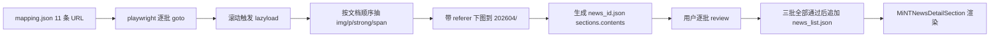

## Product Overview

mint_bio 官网第一阶段紧急显性问题整改（五一前完成），面向 PC + Mobile 双端，以"功能开关式、保守改动、模块化推进"的方式落地 6 项显性问题（口径统一暂缓）。每个功能模块完成后暂停并同步改动清单，待用户确认后再推进下一模块。

## Core Features

### 1. 新闻动态同步（11 篇公众号文章完整详情页还原）

- 沿用现有 `public/data/news_<id>.json` + `MiNTNewsDetailSection.vue` schema（headPic / footerPic / contents 块数组，支持 pic / nopaddingpic / video / desc / strongText）。
- 用 playwright 脚本实际打开公众号链接、触发 lazyload、带 referer 下载图片到 `src/assets/News/202604/`，命名 `news<id>_pic_<seq>.jpg` / `news<id>_head_<seq>.jpg`。
- 拆段为 `desc` / `strongText` 块；`strongText` 仅用项目已有 5 个 class（orange-text/blue-text/green-text/blue-green-text/strong-text）。
- 分 3 批（id=38-41 / id=42-45 / id=46-48）产出，每批 4+4+3 篇；每批完成 review 后才进入下一批。
- 列表数据在 `public/data/news_list.json` 头部按发布日期倒序插入 11 条；复用现有 `router.push MiNTNewsDetail/:id` 点击行为，不改列表组件逻辑；PC 与 Mobile 共享同一份数据。
- 分类：8 条 #MiNT 进行时（橙 #FF7200）+ 3 条 #MiNT 产品力（蓝 #144BE1，id=42/46/48）。

### 2. 全站文案口径统一（本轮暂缓）

- 5 个口径落点（首页核心能力卓越产品力 / 首页 Banner 产品板块 / 首页生物智造产品解决方案 / Footer 产品板块 / 关于我们企业概况）**本轮不做任何代码改动**，仅在主 spec 中列出 TODO 占位与对照表输入位。
- 待用户补精确对照表后，另起 Phase 1.5 统一落地（含英文对照检查）。

### 3. PiX 产品命名全量替换

- PiX001→膜袋材料 / PiX002→PiX3D 打印材料 / PiX003→注塑材料 / PiX004→地膜材料 / PiX005→纤维材料。
- 全量扫描并替换 i18n 主 JSON、`modules/{products,pages,navigation}/*`、NewMaterial 两端页面、BioIntelligent Part3/Part6、FAQ / 案例 / 图片 alt；**排除**新闻 JSON（公众号原文保留）。
- PC+Mobile 同步；`doc/zh-en/` 对照 docx 未覆盖的新名字段 en-US 保留中文原文，不自译。

### 4. 企业荣誉新增 4 项

- 落在 `CorporateVision` 页 `corpList` 数组小图墙（PC 第 234 行 + Mobile 第 209 行），追加 key=9~12。
- 使用 [skill:多模态内容生成] 参照现有 corp1~corp8.png 风格生成 4 张 1024×1024 png（corp9~corp12.png）落到 `src/assets/CorporateVision/`；接受风格瑕疵。
- PC 用字符串路径 + `getImageUrl`；Mobile 用 `require()`，两端写法保持与原有一致。

### 5. 功能模块删减

- `MiNTNewsTop.vue` 行 19-27 "下载品牌手册"按钮：用 Vue `<!-- ... -->` **注释掉**（不删除 DOM、不删 i18n 键，与 Footer 原有注释化风格一致）。
- `home.bioIntelligent.massProduction.desc`：删除"到 2025 年底产能 6 万吨"表述，保留其余文案；zh-CN + en-US 同步。

### 6. 创始人头衔更新

- 张科春 title：`创始人&首席科学家` → `创始人&科学顾问委员会主席`；position1/position2/bio 保持不变。
- 刘旻昊 title：`董事长 & 联合创始人` → `联合创始人\n董事长&CEO`，两行显示；`titleMobile` 同步；校内 position 字段（校长特别顾问 / 董事会秘书 / 西湖教育基金会副理事长等）全部保留。
- PC + Mobile 同步；若当前 title 渲染不支持换行，就近加 `white-space: pre-line` 样式。

### 7. 英文入口临时下线（功能开关）

- `src/utils/language.js` 新增 `export const FEATURE_EN_ENABLED = false`。
- `normalizeLanguage(lang)`：开关关闭时 `en` 视为无效 → fallback `zh`。
- `resolveInitialLanguage()`：开关关闭时直接返回 `DEFAULT_LANGUAGE`，并在读取时清理 `localStorage.language === 'en'` 覆写为 `zh`。
- `syncLanguageToUrl` 在开关关闭时把地址栏 `?lang=en` 自动剥离。
- Header / MobileHeader 语言切换按钮 `v-if="FEATURE_EN_ENABLED"` 隐藏（保留代码）。
- 不动 `en-US.json` / 不删任何 i18n 翻译代码 / 不动路由。
- `README.md` 末尾追加一节 **"英文版入口恢复指引"**：改一行 `FEATURE_EN_ENABLED = true` + 重新部署即可恢复，附带影响面说明。

## Tech Stack Selection

- Vue 3（script setup + options API 混用，现状维持）+ Vue Router。
- 自研 i18n：`src/utils/language.js` + `src/i18n/{zh-CN,en-US}.json` + `src/i18n/modules/*`；不引入 vue-i18n 等新依赖。
- Element Plus（Footer 布局 `el-row / el-col`）。
- Less / SCSS + PostCSS（px 转换，已 exclude `/public/`）。
- 静态 JSON 数据：`public/data/news_list.json` + `public/data/news_<id>.json`（axios 拉取）。
- Node.js 抓取脚本（playwright + node:fs）仅开发期使用，不入运行时包，不加运行时依赖。

## Implementation Approach

### 总体策略

分 **7 个功能模块**推进，每个模块完成后暂停同步改动清单等用户确认：

1. spec-init + explore-targets（建 spec + 落点精确定位）
2. 新闻批次 1（id=38-41，4 篇）
3. 新闻批次 2（id=42-45，4 篇）
4. 新闻批次 3（id=46-48，3 篇）+ 追加 `news_list.json`
5. PiX 全量重命名
6. 荣誉 corpList 追加（含 AI 生图）+ 创始人头衔
7. 品牌手册按钮注释化 + 产能 6 万吨删除 + 英文功能开关 + README 恢复指引 + 全量验收

每模块完成后输出统一的**影响范围报告**：改动文件清单 / 文案前后对比 / 新增资源 / 风险点 / 下一步预告。

### 关键技术决策

1. **新闻完整还原（playwright）**

- 落位 `scripts/fetch-news/fetch.mjs`（Node ESM 模块）+ `mapping.json`（11 条 URL/id/分类/time）+ `report.json`（抓取结果报告），放在 `scripts/` 不进 src，不影响构建。
- 启动 chromium headless 以标准 UA 打开每篇公众号文章，`await page.goto(url, { waitUntil: 'networkidle' })`，滚动到底部触发 `data-src → src` lazyload，再 `page.$eval('#js_content *')` 按文档顺序抽取 img/p/section/strong/span。
- 图片用 `context.request.get(src, { headers: { referer: 'https://mp.weixin.qq.com/' } })` 带 referer 下载，保存为 `src/assets/News/202604/news<id>_pic_<seq>.jpg`（cover 额外保存为 `news<id>_head_1.jpg`）。
- DOM → 块数组转换规则：
    - `` → `{ pic: "assets/News/..." }`
    - 段落节点（纯文本或含普通 span） → `{ desc: "..." }`
    - 含 `<strong>` 或 `color span`（红/橙/蓝/绿）的段落 → `{ strongText: "<span class='orange-text'>...</span>" }`（class 做映射：红/橙 → orange-text、蓝 → blue-text、绿 → green-text）
- 保守富文本：默认 desc，仅在确实有强调样式时才产出 strongText；不引入新 class。
- 分批执行：每批脚本命令 `npm run fetch-news -- --ids=38,39,40,41` 等；每批跑完生成 review 清单（图片数、段落数、strongText 命中、可疑片段）。

2. **抓取脚本防风控**

- 并发控制 1（串行），每篇间 sleep 3-5s；失败重试 2 次。
- User-Agent 使用桌面 Chrome；不登录，只抓公开文章。
- 所有图片保存本地后，news_<id>.json 引用相对路径，上线后不依赖微信图床。

3. **PiX 全量替换：先扫描后替换**

- 用 search_content 穷举所有 `PiX\s*00[1-5]` 出现点 → 分文件精确替换，而非全局 sed；`news_list.json` + `news_<id>.json` 全部排除；严格保持 `PiX3D 打印材料` 这种特殊写法（PiX002 → 含 3D，其他保持 `PiX + 空格 + 中文名`）。
- i18n 双端同步；如对照 docx 未覆盖，en-US 保留中文原文。

4. **英文开关 A 方案**

- 最小侵入：仅改 `src/utils/language.js` + Header / MobileHeader 的 v-if；不动 en-US.json、不动路由、不动 i18n 插件注册。
- `FEATURE_EN_ENABLED` 导出为命名常量，Header/Mobile 端通过 `import { FEATURE_EN_ENABLED } from '@/utils/language'` 拿到开关。
- `resolveInitialLanguage` 在开关关闭时顺带做一次 localStorage 清理（`en` → `zh`），避免已访问过英文版的老用户下次访问仍被记忆为英文。
- 恢复路径一行代码 + 部署；README 记录风险（开关打开后切换按钮直接出现、lang=en 恢复生效）。

5. **荣誉图 AI 生图**

- 使用 [skill:多模态内容生成] 基于现有 corp1~corp8.png 风格（白底 / 浅灰底 + 圆角 + 机构徽章 + 中文标题）生成 4 张 1024×1024 png；命名 corp9.png（企业研究院）/ corp10.png（科技新小龙）/ corp11.png（新雏鹰）/ corp12.png（准独角兽）。
- 失败或效果不佳时降级：用占位灰色卡 + 纯文字标题 png，由运营后续替换。

6. **每模块暂停的输出格式（统一模板）**

```
## 模块 N 完成报告

- 改动文件：[列表]
- 新增资源：[列表]
- 关键变更前后对比：...
- 风险 / 需用户确认点：...
- 下一模块预告：...
```

### 性能与稳定性

- 新闻列表一次加载 48 篇（<300KB），无需分页。
- 详情页已有 `MiNTNewsDetailSection.vue` 成熟渲染，图片本地化后首屏加载无微信图床依赖。
- 抓取脚本仅开发期运行，不影响运行时 bundle。
- 路由 / i18n 改动都走现有 API，无额外开销。

## Implementation Notes

- **翻译规则铁律**：`doc/zh-en/` 对照 docx 未覆盖的新字段，en-US 保留中文原文；缺失立即告知用户不自译。
- **双端同步**：所有 PC 改动必须同步 Mobile；提交前 grep `HomeMobile / CorporateVisionMobile / MiNTNewsMobile / NewMaterialMobile / BioIntelligentMobile / FooterMobile / MobileHeader`。
- **保守风格**：
- 品牌手册按钮用 Vue 注释包裹，不删 DOM。
- en-US.json / 切换按钮代码 / 路由全部保留。
- 口径统一相关 i18n key 本轮完全不动。
- **OpenSpec 主计划**：`.codebuddy/plans/website-phase1-urgent-fixes_20260423.md` 登记 7 个模块、11 篇抓取结果表、暂缓项、验收清单，每模块完成后更新状态。
- **不破坏现有行为**：
- `news_list.json` 现有 37 条不动，schema 保持一致。
- `MiNTNewsDetailSection.vue` / `MiNTNewsDetail.vue` 等渲染组件代码不动，仅数据驱动。
- `src/main.js` / `language.js` 已有 modified（语言 URL 分享改造）保持兼容，开关叠加。
- **日志与安全**：抓取脚本只记录 URL/id/图片数/耗时，不写凭据；图片带 referer 一次性下载本地。
- **富文本保守**：5 种 class 白名单，默认 desc。

## Architecture Design

### 改动分层

```
数据层      public/data/news_list.json              头部追加 11 条
            public/data/news_38.json ~ news_48.json  11 份详情 JSON
            src/assets/News/202604/*.jpg             ~130 张抓取图

脚本层      scripts/fetch-news/fetch.mjs             playwright 抓取（仅开发期）
            scripts/fetch-news/mapping.json          URL/id/分类/日期映射
            scripts/fetch-news/report.json           抓取结果报告（逐批更新）

i18n 层     src/i18n/zh-CN.json / en-US.json         头衔 / 产能 / PiX
            src/i18n/modules/{navigation,pages,products}/*  PiX
            口径相关 key                              本轮不动，仅 TODO

组件层      src/components/MiNTNews/MiNTNewsTop.vue  注释品牌手册按钮
            src/components/Header/ + MobileHeader/   语言切换按钮 v-if
            src/pages/CorporateVision*/              corpList 追加 + 头衔
            src/pages/NewMaterial*/                  PiX 改名
            src/components/BioIntelligent/Part3/6    PiX 改名

图片层      src/assets/CorporateVision/corp9~12.png  AI 生成 4 张荣誉图

工具层      src/utils/language.js                    新增 FEATURE_EN_ENABLED 开关

文档层      README.md                                 末尾追加"英文版入口恢复指引"
            .codebuddy/plans/website-phase1-urgent-fixes_20260423.md  主 spec
```

### 新闻还原流程



## Directory Structure

```
d:/UGit/mint_bio/
├── .codebuddy/plans/
│   └── website-phase1-urgent-fixes_20260423.md   # [NEW] 主 spec：7 模块 todo、11 篇抓取表、口径暂缓项、验收清单，每模块完成后同步。
│
├── scripts/fetch-news/                            # [NEW-DIR] 仅开发期使用。
│   ├── fetch.mjs                                  # [NEW] playwright 抓取：goto+滚动+抽 DOM+带 referer 下图+产 news_<id>.json。支持 --ids= 参数分批。
│   ├── mapping.json                               # [NEW] 11 条 URL / id=38~48 / categorylabel / categorycolor / time 映射。
│   └── report.json                                # [NEW] 抓取结果报告（每批更新）。
│
├── public/data/
│   ├── news_list.json                             # [MODIFY] 头部追加 11 条（id=38~48），schema 与现有 37 条一致。
│   ├── news_38.json ~ news_48.json                # [NEW] 11 份详情 JSON（分 3 批产出：38-41 / 42-45 / 46-48）。
│
├── src/assets/News/202604/                         # [NEW-DIR] 11 篇图片批次，命名 news<id>_pic_<seq>.jpg / news<id>_head_<seq>.jpg。
│
├── src/i18n/
│   ├── zh-CN.json                                  # [MODIFY] (1) corporate.founders.zhang.title 改新头衔；(2) corporate.founders.liu.title + titleMobile 改新头衔含 \n；(3) home.bioIntelligent.massProduction.desc 去 6 万吨；(4) FAQ/案例中 PiX 00X 精确替换。口径相关 key 本轮不动。
│   └── en-US.json                                  # [MODIFY] 同步以上字段；对照 docx 未覆盖者保留中文原文。
│
├── src/i18n/modules/
│   ├── navigation/{zh-CN,en-US}.json               # [MODIFY] PiX 型号名精确替换；口径 key 不动。
│   ├── pages/{zh-CN,en-US}.json                    # [MODIFY] PiX 型号名；home.sections.products 不动。
│   └── products/{zh-CN,en-US}.json                 # [MODIFY] PiX 型号名统一。
│
├── src/components/MiNTNews/
│   └── MiNTNewsTop.vue                             # [MODIFY] 行 19-27 "下载品牌手册" 按钮 Vue 注释包裹，不删 DOM，不删 i18n 键。
│
├── src/components/Header/index.vue                 # [MODIFY] 语言切换按钮追加 `v-if="FEATURE_EN_ENABLED"`，import 开关常量。
├── src/components/MobileHeader/                    # [MODIFY] 同步 Header。
│
├── src/components/BioIntelligent/
│   ├── BioIntelligentPart3.vue                     # [MODIFY] PiX 型号 hardcode 精确替换。
│   └── BioIntelligentPart6.vue                     # [MODIFY] 同上。
│
├── src/assets/CorporateVision/
│   ├── corp9.png                                   # [NEW] 浙江省企业研究院（AI 生成）
│   ├── corp10.png                                  # [NEW] 浙江省"科技新小龙"（AI 生成）
│   ├── corp11.png                                  # [NEW] 杭州市新雏鹰企业（AI 生成）
│   └── corp12.png                                  # [NEW] 杭州市准独角兽榜单（AI 生成）
│
├── src/pages/CorporateVision/index.vue             # [MODIFY] (1) 创始人 title 渲染，必要时加 white-space: pre-line；(2) corpList 数组追加 4 项 key=9~12 imgSrc=assets/CorporateVision/corp9~12.png；口径 intro 不动。
├── src/pages/CorporateVisionMobile/index.vue       # [MODIFY] PC 改动 Mobile 同步；corpList 用 require(@/assets/CorporateVision/corp9~12.png)；liu.titleMobile 单独字段。
│
├── src/pages/NewMaterial/index.vue                 # [MODIFY] PiX001~005 卡片/标题/描述精确替换。
├── src/pages/NewMaterialMobile/index.vue           # [MODIFY] 同步 Mobile。
│
├── src/utils/language.js                           # [MODIFY] 新增 `export const FEATURE_EN_ENABLED = false`；normalizeLanguage 禁 en；resolveInitialLanguage 清 localStorage；syncLanguageToUrl 剥离 ?lang=en。保留所有现有 API。
│
├── src/main.js                                     # [VERIFY] 与 language.js 已 modified 兼容，确认不额外读写 en。
│
└── README.md                                       # [MODIFY] 末尾追加"## 英文版入口恢复指引"小节：一行代码开关 + 部署指引 + 影响面说明。
```

## Key Code Structures

### news_<id>.json 详情 schema（沿用现有）

```
{
  "id": 48,
  "title": "Mint 产品力｜元素驱动PiX全生物降解地膜为传统中药披上绿色\"新衣\"",
  "categorylabel": "#MiNT 产品力",
  "categorycolor": "#144BE1",
  "time": "2026/04/18",
  "pic": "assets/News/202604/news48_pic_1.jpg",
  "coverPic": "assets/News/202604/news48_pic_1.jpg",
  "overviewtitle": "...",
  "sections": [
    {
      "headPic": ["assets/News/202604/news48_head_1.jpg"],
      "contents": [
        { "desc": "..." },
        { "pic": "assets/News/202604/news48_pic_2.jpg" },
        { "strongText": "<span class='orange-text'>关键强调句</span>" }
      ],
      "footerPic": []
    }
  ]
}
```

### 英文开关核心签名（示意）

```js
export const FEATURE_EN_ENABLED = false

function normalizeLanguage(lang) {
  if (!FEATURE_EN_ENABLED && lang === 'en') return null
  return SUPPORTED_LANGUAGES.includes(lang) ? lang : null
}

function resolveInitialLanguage() {
  if (!FEATURE_EN_ENABLED) {
    try {
      if (localStorage.getItem(LANGUAGE_STORAGE_KEY) === 'en') {
        localStorage.setItem(LANGUAGE_STORAGE_KEY, DEFAULT_LANGUAGE)
      }
    } catch (e) { /* ignore */ }
    return DEFAULT_LANGUAGE
  }
  return getLanguageFromUrl() || getStoredLanguage() || DEFAULT_LANGUAGE
}
```

## Agent Extensions

### SubAgent

- **code-explorer**
- Purpose: 精确定位 PiX001~005 在 Vue/JSON 中的所有散落位置（尤其 NewMaterial 两端、BioIntelligent Part3/6、FAQ）、Header/MobileHeader 语言切换按钮的 DOM 节点、CorporateVision 两端 `corpList` / 创始人 title 的具体行号，产出行号级改动清单。
- Expected outcome: 分模块的改动位置表，含文件路径 + 行号 + 上下文片段，驱动后续精确替换不误伤。

### Skill

- **i18n-translator**
- Purpose: 对照 `doc/zh-en/` 4 份 docx 落地 PiX 新名 / 创始人头衔 / 产能 6 万吨删除等字段的 zh-CN + en-US 同步，未覆盖字段保留中文原文。
- Expected outcome: 两端 JSON 改动一致，对照规则不被破坏。
- **playwright-cli**
- Purpose: 作为 `scripts/fetch-news/fetch.mjs` 的运行基座，逐批（4+4+3）打开公众号链接、滚动触发 lazyload、按顺序抽 DOM 节点、带 referer 下载图片落地到 `src/assets/News/202604/`，产出 11 份 news_<id>.json 初稿 + report.json。
- Expected outcome: 每批产出图片与 JSON 初稿，并给用户 review 清单（图片数、段落数、strongText 命中、可疑片段）。
- **多模态内容生成**
- Purpose: 参照现有 corp1~corp8.png 视觉风格（白底 / 圆角 / 机构徽章 / 中文标题）生成 4 张荣誉图（企业研究院 / 科技新小龙 / 新雏鹰 / 准独角兽），落到 `src/assets/CorporateVision/corp9~corp12.png`。
- Expected outcome: 4 张 1024×1024 png 可直接上线，接受风格瑕疵，后续由运营替换真图。
- **docx**
- Purpose: 读取 `doc/zh-en/` 4 份翻译对照 docx，比对本次新增字段命中情况，生成"已覆盖 / 未覆盖"清单指导 en-US 落地。
- Expected outcome: 命中清单输出，驱动 i18n-translator 精准工作。
- **Browser Automation**
- Purpose: 抓取脚本失败兜底时，人工浏览上下文补齐单篇图片或验证 img src 防盗链规律。
- Expected outcome: 失败篇目的补救素材路径与证据。