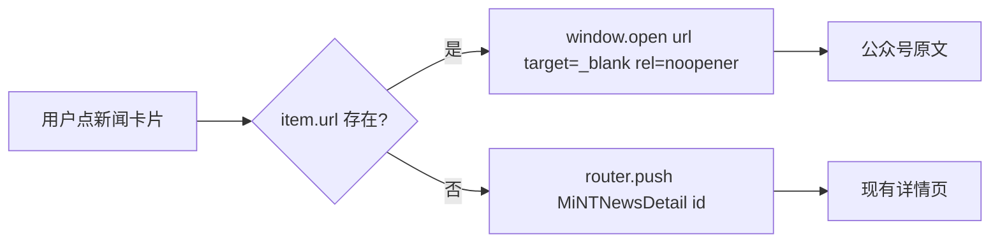

## Product Overview

mint_bio 官网第一阶段紧急显性问题整改（五一节前完成）。面向官网 PC + Mobile 双端，围绕"新闻同步、口径统一、产品改名、荣誉新增、模块删减、创始人头衔、英文下线"七项显性问题做最小闭环修复，保证对外形象与公司最新官方表述一致。

## Core Features

### 1. 新闻动态同步（11 篇公众号文章）

- 在 `public/data/news_list.json` 头部插入 11 条新闻条目（按公众号发布日期倒序），字段：`id / title / time / pic / categorylabel / categorycolor / overviewtitle / url`。
- 新增字段 `url` 指向公众号原文链接，列表卡片/头条预览点击时新窗口打开原文；不录入详情页正文。
- 分类映射：8 条 `#MiNT 进行时`（橙 `#FF7200`）、3 条 `#MiNT 产品力`（蓝 `#144BE1`，分别为"生物降解笔材"、"DIN CERTCO 认证"、"PiX 地膜为中药披绿衣"）。
- 首图从公众号原文抓取首张 cover，落地到 `src/assets/News/202604/` 目录并在 JSON 中引用；抓取失败时使用占位图并在计划中标注。
- PC 与 Mobile 复用同一份 `news_list.json`，分类筛选、头条 Overview、卡片列表点击行为一致。

### 2. 全站文案口径统一

- 5 个口径落点（首页 · 核心能力 · 卓越产品力；首页 Banner 产品板块；首页 · 生物智造 · 产品解决方案；Footer 产品板块；关于我们 · 企业概况）预留"文案对照表"占位，等用户补充精确对照表后按位逐点替换。
- Footer 产品板块先行落地（用户已明确）：`nav.material` → "全生命周期低碳未来材料"、`nav.aminoAcid` → "绿色生物合成氨基酸"，节豆日粮保留。
- 英文版对应 i18n 按项目规则：`doc/zh-en/` 对照 docx 中无对应翻译的字段，保留中文原文，不自译。

### 3. PiX 产品命名全量替换

- 全站 PiX001~PiX005 / PiX 001~PiX 005 统一更名为：膜袋材料 / 3D 打印材料 / 注塑材料 / 地膜材料 / 纤维材料。
- 覆盖范围：i18n 两份主 JSON、`modules/*/zh-CN.json`、NewMaterial 两端页面、BioIntelligent 分块组件、FAQ 叙述文案、图片 alt 等；新闻标题若含 PiX 保持公众号原标题不做替换。

### 4. 企业荣誉新增

- 落点确认：`关于我们 · 企业概况`（`src/pages/CorporateVision/index.vue` 和 `CorporateVisionMobile/index.vue`）中由 `corpList` 数组驱动渲染的 **荣誉图片墙**，当前有 8 张 `corp1.png~corp8.png`（位于 `src/assets/CorporateVision/`），布局是 v-for 小图 + hover 缩放，每项一张独立 png。
- 新增 4 项荣誉：浙江省企业研究院；浙江省"科技新小龙"；杭州市新雏鹰企业；杭州市准独角兽榜单企业（2023-2026）。
- **图片来源（已确认）**：由 AI 参考现有 `corp1~corp8.png` 视觉风格（白底/浅灰底 + 圆角 + 机构/证书 logo + 中文标题），使用 `image_gen` 工具生成 4 张新荣誉图，命名为 `corp9.png ~ corp12.png`，落到 `src/assets/CorporateVision/`；接受一定风格瑕疵，后续由运营/设计替换真图。
- 在 PC (`corpList` data 数组) 与 Mobile (`corpList` data 数组) 末尾追加 4 项，key 分别为 9/10/11/12，imgSrc 指向对应 png；保持现有 `transform: "scale(1)"` 结构与 hover 缩放交互。
- Mobile 版需用 `require("@/assets/CorporateVision/corpN.png")` 写法保持与现有条目一致。

### 5. 功能模块删减

- 删除关于我们-发展动态 `MiNTNewsTop.vue` 中"下载品牌手册"按钮（PC+Mobile 对应位置一并清理；i18n 文案键可保留）。
- 修改首页·生物智造·量产无忧卡片 `home.bioIntelligent.massProduction.desc`，删除"到 2025 年底产能 6 万吨"表述，其余文案保留。

### 6. 创始人头衔更新

- 张科春主 title：`创始人&首席科学家` → `创始人&科学顾问委员会主席`（position/bio 保持不变）。
- 刘旻昊主 title：`董事长 & 联合创始人` → `联合创始人 / 董事长&CEO`（两行显示，校内 position 字段保留）。
- PC (`CorporateVision/index.vue`) 与 Mobile (`CorporateVisionMobile/index.vue`) 同步；若原渲染不支持换行，使用 `\n` + `white-space: pre-line` 或拆成两行字段。

### 7. 英文入口下线

- Header 与 MobileHeader 隐藏语言切换按钮。
- 路由层加入守卫：访问 `/en`、`/en/*`、`?lang=en` 等均重定向到中文版对应页；`utils/language.js` 强制 `zh-CN`。
- 保留 en-US.json 与切换逻辑代码（注释或配置开关），便于后续英文版上线恢复。

## Tech Stack Selection

- 复用当前项目现有技术栈，不引入新依赖：
- Vue 3 (script setup) + Vue Router
- 自研 i18n 方案：`src/utils/language.js` + `src/i18n/{zh-CN,en-US}.json` + `src/i18n/modules/*`
- Element Plus（Footer 布局 `el-row / el-col`）
- Less + PostCSS（px 转换已配置，`/public/` 目录已被 exclude）
- 静态 JSON 数据：`public/data/news_list.json` + `public/data/news_<id>.json`（axios 拉取）

## Implementation Approach

### 总体策略

分 7 条并行独立轨道 + 1 条阻塞项（口径对照表）推进。以"数据改动 → i18n 文案改动 → Vue 组件改动 → 路由/工具链改动"的顺序最小化跨文件耦合。所有改动保持向后兼容：保留原有 i18n 兜底键、保留英文版代码与资源文件，避免产生架构级改动。

### 关键技术决策

1. **新闻外链跳转 vs 详情页**：用户选择外链跳转，避免录入 37 篇之后的 11 篇正文 / 图片，显著降低工作量。实现方式是在 `news_list.json` 新增 `url` 字段，`NewsCardPreview.vue` / `MiNTNewsOverview.vue` / `MiNTNewsListPreview.vue` 的点击 handler 优先判断 `item.url`，存在则 `window.open(url, '_blank', 'noopener')`，否则走原详情路由。向后兼容已有 37 篇数据。
2. **首图获取策略**：由 subagent 调用浏览器能力访问公众号链接抓取 cover 图片，按 `news_<id>_pic_1.jpg` 命名落到 `src/assets/News/202604/`（2026 年 4 月批次）。失败时使用通用占位图 `src/assets/News/default_cover.jpg`（若无则复用最近一期同分类首图），并在 plan 执行时向用户提示。
3. **PiX 全量替换**：采用"先扫描定位，再精确替换"的方式，而非全局 sed，避免误伤公众号原标题中的 PiX 字样（如新闻标题"PiX 材料开发 3D 打印"）。受影响文件使用 `search_content` 逐一确认后替换。
4. **口径对照表占位**：用户承诺后补文案对照表，因此本阶段先交付 Footer 已明确的 2 条 + 预留 5 个落点的空位占位 TODO（不改动 Vue 源码，只在 i18n 对应 key 上留 `// TODO: 口径对照` 注释），等用户补充后一次性替换，避免反复改 Vue 组件。
5. **英文路由兜底**：不使用路由前缀式 i18n（项目本来就没有 `/en` 路由前缀），而是通过 `router.beforeEach` 检测 `to.path.startsWith('/en')` 或 `to.query.lang === 'en'` → `next({ path, query: { ...query, lang: undefined } })`；同时在 `utils/language.js` 里硬编码 `currentLang = 'zh-CN'` 并跳过 localStorage 写入 `en-US` 的路径。
6. **荣誉展示区**：落点已确认为 `CorporateVision/index.vue` + `CorporateVisionMobile/index.vue` 的 `corpList` data 数组（非 `banners.png` 大图）。因用户选择方案 B（AI 生成 4 张新荣誉图），实施时用 `image_gen` 工具基于"白底圆角 + 机构/证书 logo + 中文标题"风格生成 4 张 1024x1024 png，落到 `src/assets/CorporateVision/corp9~corp12.png`，在两端 `corpList` 数组末尾追加 4 项。

### 性能与稳定性

- 新闻列表一次加载全部 48 篇（37+11），数据量可控（<200KB），不需要分页。
- 外链跳转加 `rel="noopener noreferrer"` 避免 tab-nabbing。
- i18n JSON 改动是 O(1) key 替换，无运行时性能影响。
- 路由守卫只在 `/en*` 命中时触发一次 redirect，无额外开销。

## Implementation Notes

- **i18n 翻译规则铁律**：新增中文字段（新产品名、新荣誉、新头衔、口径新文案）在 `doc/zh-en/` 对照 docx 中无对应翻译时，`en-US.json` 中对应位置**保留中文原文**，不自译。执行时遇到对照文件缺失需立即停下告知用户。
- **双端同步**：所有 PC 改动必须在对应 `*Mobile` 组件中做等价改动；提交前 grep 检查 `HomeMobile/CorporateVisionMobile/MiNTNewsMobile/NewMaterialMobile/BioIntelligentMobile` 是否遗漏。
- **OpenSpec 计划维护**：在 `.codebuddy/plans/` 新建 `website-phase1-urgent-fixes_20260423.md`，记录 7 条待办项、对照表占位、外链 URL 列表、抓图结果，实施中同步更新状态。
- **不破坏现有行为**：
- 不删 `en-US.json`，不删 `MiNTNewsTop.vue` 中 `downloadBrochure` i18n 键。
- 不重构 `news_list.json` schema，`url` 字段为 optional 增量字段。
- 不修改已有 37 篇新闻内容、不改动 category / categorycolor 枚举。
- **日志与异常**：外链跳转失败（url 缺失）时降级走原详情路由，不 alert；i18n 取不到新 key 时回落原文，保持现有 `getText` 行为。
- **git 状态兼容**：当前 `src/main.js` / `src/utils/language.js` 已 modified，先 `git diff` 确认未提交改动与本次目标不冲突，再叠加修改。

## Architecture Design

### 改动分层

```
数据层      public/data/news_list.json            新增 11 条 + url 字段
            src/assets/News/202604/*.jpg           11 张首图

i18n 层      src/i18n/zh-CN.json                   头衔/产能/Footer 菜单/PiX 文案/企业概况
            src/i18n/en-US.json                   同上（无对照则保留中文）
            src/i18n/modules/navigation/*.json    Footer 产品菜单口径
            src/i18n/modules/pages/*.json         home.sections.products 口径
            src/i18n/modules/products/*.json      PiX 产品型号名
            src/i18n/modules/news/*.json          （本阶段不改，新闻数据走 JSON）

组件层       src/components/MiNTNews/              新闻列表 / 头条 / 卡片 / Top 删按钮
            src/components/MiNTNewsList*.vue      分类筛选 & 外链跳转
            src/components/Header/index.vue       隐藏语言切换
            src/components/MobileHeader/*         隐藏语言切换
            src/pages/CorporateVision*/           荣誉区追加 / 头衔渲染
            src/pages/NewMaterial*/               PiX 改名文案
            src/components/BioIntelligent/        PiX 改名 + 产品解决方案口径

路由/工具层 src/router/index.js                   /en* 重定向守卫
            src/utils/language.js                 强制 zh-CN
            src/main.js                           语言初始化校验

计划/文档   .codebuddy/plans/website-phase1-urgent-fixes_20260423.md
```

### 新闻跳转流程



## Directory Structure

```
d:/UGit/mint_bio/
├── .codebuddy/plans/
│   └── website-phase1-urgent-fixes_20260423.md   # [NEW] 本次整改主计划 spec。记录 7 条 todo、对照表占位、抓图结果、验收清单，按 OpenSpec 规范维护；每条 todo 完成后同步状态。
│
├── public/data/
│   └── news_list.json                            # [MODIFY] 头部插入 11 条新闻（按日期倒序 2026-01~2026-04）。字段：id(38-48) / title / time / pic / categorylabel / categorycolor / overviewtitle / url。保留现有 37 条不动。
│
├── src/assets/News/202604/                        # [NEW-DIR] 11 张公众号首图，命名 news_<id>_pic_1.jpg，由 subagent 抓取，失败时使用占位图并标注。
│
├── src/i18n/
│   ├── zh-CN.json                                 # [MODIFY] 改动点：(1) corporate.founders.zhang.title; (2) corporate.founders.liu.title + titleMobile; (3) home.bioIntelligent.massProduction.desc 去掉 6 万吨; (4) nav.material / nav.aminoAcid 改口径; (5) FAQ/案例中的 PiX 00X 全量替换; (6) corporate.intro1~3 预留口径对照占位。
│   └── en-US.json                                 # [MODIFY] 同上字段改动；按 doc/zh-en/ 对照 docx，未覆盖字段保留中文原文（不自译）。
│
├── src/i18n/modules/
│   ├── navigation/zh-CN.json                      # [MODIFY] products.materials / aminoAcids 口径统一。
│   ├── navigation/en-US.json                      # [MODIFY] 同步；未覆盖字段保留中文。
│   ├── pages/zh-CN.json                           # [MODIFY] home.sections.products.materials / aminoAcids 口径占位（等对照表）；PiX 型号名更新。
│   ├── pages/en-US.json                           # [MODIFY] 同步。
│   ├── products/zh-CN.json                        # [MODIFY] PiX 系列五型号命名统一。
│   └── products/en-US.json                        # [MODIFY] 同步。
│
├── src/components/MiNTNews/
│   ├── MiNTNewsList.vue                           # [MODIFY] 分类筛选保持；如有需要更新分类枚举注释；不改数据来源。
│   ├── MiNTNewsListMobile.vue                     # [MODIFY] 同上 Mobile 版。
│   ├── MiNTNewsListPreview.vue                    # [MODIFY] 点击 handler 新增 url 分支：有 url → window.open，否则走 router。
│   ├── MiNTNewsOverview.vue                       # [MODIFY] 头条预览点击同样支持 url 外链。
│   ├── NewsCardPreview.vue                        # [MODIFY] 卡片点击事件同步支持 url。
│   └── MiNTNewsTop.vue                            # [MODIFY] 删除"下载品牌手册"按钮（19-27 行区块），保留其余 Banner 文案；Mobile 对应版本同步。
│
├── src/components/Footer/
│   └── index.vue                                  # [MODIFY] 无需改 DOM（文案走 i18n `nav.material/nav.aminoAcid`），随 i18n 改口径自动更新。已注释的"下载品牌手册"保持注释。
├── src/components/FooterMobile/                    # [MODIFY] 同步校对；若 Mobile 独立文案则同步改。
│
├── src/components/Header/index.vue                 # [MODIFY] 隐藏语言切换 DOM（v-if="false" 或 CSS display:none，保留代码）。
├── src/components/MobileHeader/                    # [MODIFY] 同步隐藏语言切换。
│
├── src/components/BioIntelligent/
│   ├── BioIntelligentPart3.vue                    # [MODIFY] PiX 型号名引用更新（若有 hardcode）。
│   ├── BioIntelligentPart6.vue                    # [MODIFY] 同上。
│   └── BioIntelligentPart*.vue                    # [MODIFY] 产品解决方案口径落点（等对照表）；subagent 逐个扫查确认。
│
├── src/pages/Home/index.vue                        # [MODIFY] 核心能力·卓越产品力 / Banner 产品板块 口径落点（等对照表）；PC 版。
├── src/pages/HomeMobile/                           # [MODIFY] Mobile 对应口径改动。
│
├── src/pages/BioIntelligent/index.vue              # [MODIFY] 量产无忧卡片文案（i18n 驱动，随 i18n 改即可）；产品解决方案口径。
├── src/pages/BioIntelligentMobile/                 # [MODIFY] 同步 Mobile。
│
├── src/assets/CorporateVision/                    # [MODIFY] 追加 corp9.png~corp12.png 共 4 张 AI 生成的荣誉图（企业研究院/科技新小龙/新雏鹰/准独角兽），风格参考现有 corp1~corp8。
│
├── src/pages/CorporateVision/index.vue             # [MODIFY] (1) 企业概况 intro 口径（等对照表）；(2) 创始人主 title 渲染（张/刘）；(3) `corpList` data 数组末尾追加 4 项荣誉，key=9~12，imgSrc 指向 "assets/CorporateVision/corp9~12.png"。若原 title 渲染不支持换行，改用 `white-space: pre-line` + `\n`。
├── src/pages/CorporateVisionMobile/                # [MODIFY] PC 所有改动 Mobile 同步；注意 liu.titleMobile 单独字段；`corpList` 用 `require("@/assets/CorporateVision/corp9~12.png")` 写法追加 4 项。
│
├── src/pages/NewMaterial/index.vue                 # [MODIFY] PiX001~005 产品卡片/标题/描述全量替换为新名。
├── src/pages/NewMaterialMobile/index.vue           # [MODIFY] 同步 Mobile。
│
├── src/pages/Vision/                               # [VERIFY] 如荣誉展示在此，由 subagent 定位后追加文字条目；否则不动。
├── src/pages/VisionMobile/                         # [VERIFY] 同上。
│
├── src/router/
│   └── index.js                                    # [MODIFY] 新增 beforeEach 守卫：to.path 匹配 /^\/en(\/|$)/ 或 to.query.lang==='en' → 重写为中文路径并 next(redirect)。
│
├── src/utils/
│   └── language.js                                 # [MODIFY] 强制 currentLang='zh-CN'；getText 直接取 zh-CN.json；保留 en-US 读取代码但不被触发；localStorage 若存 'en-US' 则清理或覆盖为 'zh-CN'。
│
└── src/main.js                                     # [MODIFY/VERIFY] 语言初始化校验：确保不从 URL/localStorage 设置成 en-US；与 language.js 已有 modified 改动叠加兼容。
```

## Key Code Structures

### news_list.json 新闻条目结构（新增 url 字段）

```
{
  "id": 48,
  "title": "Mint 产品力｜元素驱动PiX全生物降解地膜为传统中药披上绿色\"新衣\"",
  "time": "2026/04/18",
  "pic": "assets/News/202604/news48_pic_1.jpg",
  "categorylabel": "#MiNT 产品力",
  "categorycolor": "#144BE1",
  "overviewtitle": "元素驱动PiX全生物降解地膜为传统中药披上绿色\"新衣\"",
  "url": "https://mp.weixin.qq.com/s/BjYxYC4itGLEewMvcDCdZw"
}
```

### 新闻卡片点击 handler 片段（示意）

```js
function handleNewsClick(item) {
  if (item.url) {
    window.open(item.url, '_blank', 'noopener,noreferrer')
    return
  }
  router.push({ name: 'mintNewsDetail', params: { id: item.id } })
}
```

### 路由 /en 兜底守卫（示意）

```js
router.beforeEach((to, from, next) => {
  const enPath = /^\/en(\/|$)/
  if (enPath.test(to.path) || to.query.lang === 'en') {
    const zhPath = to.path.replace(enPath, '/')
    const { lang, ...restQuery } = to.query
    return next({ path: zhPath || '/', query: restQuery, replace: true })
  }
  next()
})
```

## Agent Extensions

### SubAgent

- **code-explorer**
- Purpose: 深度扫描荣誉展示区落点（CorporateVision / Vision / HomeMobile 相关 Vue 组件）、穷尽 PiX001~005 散落位置、核对 5 个口径落点的精确 DOM 位置、校对 Mobile 版对齐情况。
- Expected outcome: 产出完整文件清单 + 每个改动位置的行号/上下文快照，用于在实施阶段做精确替换而非正则全局替换。

### Skill

- **i18n-translator**
- Purpose: 严格按 `doc/zh-en/` 对照 docx 落地 i18n 键值改动（创始人头衔、产能文案、PiX 产品名、Footer 菜单、口径对照表），处理 zh-CN / en-US 双端 JSON 更新与 Vue 模板 getText() 对接；遇到对照文件缺失字段立即停下提示用户。
- Expected outcome: zh-CN.json / en-US.json / modules/*/*.json 改动一致、对照规则不被破坏，未覆盖字段保留中文原文。

- **Browser Automation** / **playwright-cli**
- Purpose: 抓取 11 篇公众号原文的首图与正文摘要（`overviewtitle`），保存到 `src/assets/News/202604/` 并记录抓取结果。
- Expected outcome: 11 张 cover 图片落地 + 每篇简要摘要可用于 `overviewtitle`；失败条目有明确占位方案。

- **image_gen**
- Purpose: 生成 4 张新荣誉图（企业研究院 / 科技新小龙 / 新雏鹰 / 准独角兽）落到 `src/assets/CorporateVision/corp9~corp12.png`，风格参考 corp1~corp8（白底圆角 + 机构/证书 logo + 中文标题）。
- Expected outcome: 4 张 1024x1024 png 直接可用，接受 AI 生成的风格瑕疵。

- **docx**
- Purpose: 读取 `doc/zh-en/` 下 4 份翻译对照 docx，比对本次新增/修改的中文字段是否有对应英文翻译，生成对照命中清单。
- Expected outcome: 输出"已覆盖 / 未覆盖"字段明细，指导 en-US.json 哪些可翻译哪些保留中文。

- **pdf**
- Purpose: 读取 `doc/update/updatedetail.pdf` 的截图区域，辅助核对 7 项整改要求的视觉细节（荣誉区位置、创始人卡片排版、Banner 产品板块样式）。
- Expected outcome: 补充 PDF 中截图所示的目标视觉效果，用于验收对比。