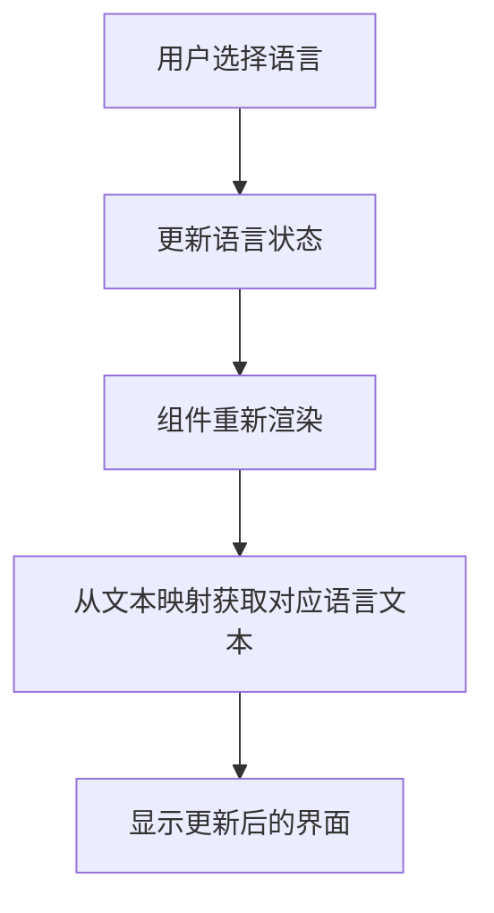

## 项目概述

回退所有i18n相关的修改到原始状态，然后实现一个简单可靠的中英文切换功能，不使用复杂的vue-i18n库。

## 核心功能

- 完全移除vue-i18n相关的依赖和代码
- 恢复项目到之前可正常运行的状态
- 实现基础的中英文语言切换
- 使用简单的状态管理和文本映射方案
- 确保页面能正常显示和运行

## 技术栈

- 前端框架：Vue 3 + TypeScript
- 状态管理：Vuex 或简单的响应式状态
- 样式：现有的CSS/样式方案
- 语言切换：自定义简单实现

## 技术架构

### 系统架构

使用简单的语言切换架构，避免复杂的i18n库：

- 语言状态管理层：使用Vue的响应式系统存储当前语言
- 文本映射层：简单的对象映射存储中英文文本
- 组件层：直接从映射对象获取对应语言的文本



### 模块划分

- **语言状态模块**：管理当前选中的语言（中文/英文）
- **文本映射模块**：存储所有需要翻译的文本内容
- **语言切换组件**：提供语言切换的UI界面

### 数据流

用户点击语言切换 → 更新全局语言状态 → 触发组件重新渲染 → 显示对应语言文本

## 实现细节

### 核心目录结构

```
src/
├── composables/
│   └── useLanguage.ts     # 语言状态管理
├── utils/
│   └── i18n.ts           # 简单的文本映射
├── components/
│   └── LanguageSwitcher.vue  # 语言切换组件
```

### 关键代码结构

**语言状态管理**：使用Vue的响应式系统管理当前语言状态

```typescript
// useLanguage composable
export const useLanguage = () => {
  const currentLang = ref<'zh' | 'en'>('zh')
  const switchLanguage = (lang: 'zh' | 'en') => {
    currentLang.value = lang
  }
  return { currentLang, switchLanguage }
}
```

**文本映射对象**：简单的键值对映射存储中英文文本

```typescript
// 文本映射
export const texts = {
  welcome: {
    zh: '欢迎',
    en: 'Welcome'
  },
  // 其他文本...
}
```

### 技术实现计划

1. **回退修改**

- 问题分析：识别所有vue-i18n相关的文件和依赖
- 解决方案：彻底移除所有vue-i18n代码和配置
- 关键技术：Git回退、依赖清理
- 实现步骤：检查文件变更、移除依赖、清理配置、验证回退
- 测试策略：确保应用能正常启动和运行

2. **简单语言切换实现**

- 问题分析：需要轻量级的语言切换方案
- 解决方案：使用Vue响应式状态 + 简单对象映射
- 关键技术：Vue Composition API、响应式状态管理
- 实现步骤：创建语言状态、定义文本映射、实现切换逻辑、更新组件
- 测试策略：验证语言切换功能和文本显示正确性

### 集成要点

- 语言状态通过provide/inject在组件间共享
- 文本获取通过简单的函数调用实现
- 避免复杂的插件配置和依赖注入

## 技术考量

### 性能优化

- 使用简单的对象查找，避免复杂的国际化处理
- 文本映射在应用启动时一次性加载
- 响应式更新只影响使用了语言文本的组件

### 可维护性

- 文本集中管理在单一文件中
- 简单的API，易于理解和维护
- 避免过度工程化，保持代码简洁

## 智能体扩展

### SubAgent

- **code-explorer**
- 目的：全面探索项目结构，识别所有vue-i18n相关的文件和配置
- 预期结果：获得完整的文件清单，了解当前i18n实现的范围，为回退操作提供准确的目标文件列表