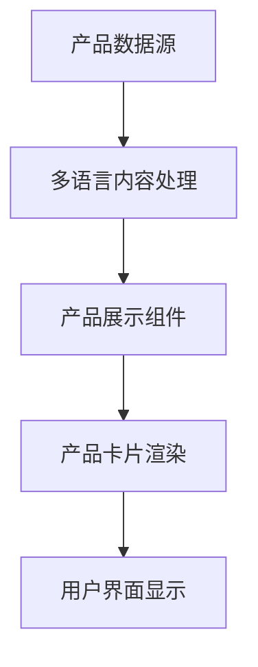

## 产品概览

更新薄荷生物产品展示界面的中英文内容，提升产品信息的准确性和专业性。

## 核心功能

- 更新6个核心产品的中英文名称翻译
- 完善产品性能优势描述的中英文对照
- 更新产品应用领域的专业术语翻译
- 确保产品展示界面的多语言一致性

## 技术栈选择

基于现有项目结构，保持当前技术栈不变，专注于内容更新。

## 架构设计

### 系统架构

- 架构模式：内容管理模式（保持现有架构，仅更新数据层内容）
- 组件结构：产品展示组件 → 产品卡片组件 → 多语言内容组件

### 模块划分

- **产品数据模块**：包含产品名称、性能优势、应用领域的中英文数据结构
- **多语言管理模块**：处理中英文内容切换和显示逻辑
- **产品展示模块**：负责产品信息的渲染和布局

### 数据流程



## 实现细节

### 核心目录结构

```
mint_bio/
├── src/
│   ├── data/
│   │   └── products.json          # 更新：产品中英文内容数据
│   ├── components/
│   │   └── ProductDisplay.tsx     # 修改：产品展示组件
│   └── locales/
│       ├── zh-CN.json            # 更新：中文翻译文件
│       └── en-US.json            # 更新：英文翻译文件
```

### 关键代码结构

**产品数据接口**：定义产品信息的数据结构，包含中英文字段和产品详细信息。

```typescript
interface ProductData {
  id: string;
  name: {
    zh: string;
    en: string;
  };
  advantages: {
    zh: string[];
    en: string[];
  };
  applications: {
    zh: string[];
    en: string[];
  };
}
```

### 技术实现方案

#### 内容更新策略

1. **数据结构标准化**：统一产品信息的数据格式
2. **多语言支持**：确保中英文内容的准确对应
3. **内容验证**：检查翻译质量和术语一致性
4. **界面适配**：确保不同语言内容在界面上正确显示

#### 集成要点

- 保持现有组件结构和样式不变
- 仅更新数据源和翻译文件
- 确保多语言切换功能正常运行
- 验证产品信息显示的完整性

## 技术考量

### 内容管理

- 遵循现有项目的多语言管理模式
- 保持翻译术语的专业性和一致性

### 质量保证

- 验证产品名称翻译的准确性
- 确保性能优势描述的专业性
- 检查应用领域术语的规范性

## 智能扩展

### 子代理

- **code-explorer**
- 目的：探索现有项目结构，定位产品展示相关文件
- 预期结果：找到产品数据文件、组件文件和多语言配置文件的确切位置