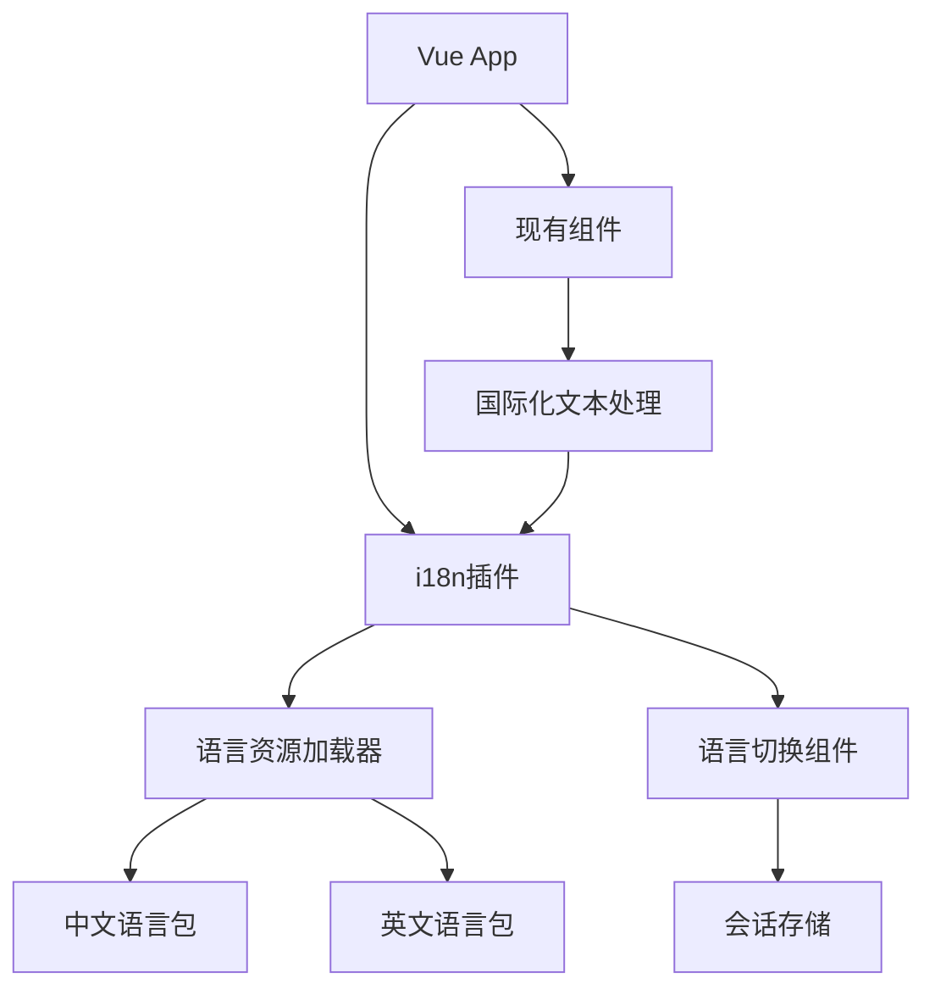

## 产品概述

为mint_bio项目构建完整的国际化支持系统，基于vue-i18n实现中英文切换功能，与现有Vue3+Element Plus技术栈完全兼容

## 核心功能

- 基于vue-i18n建立完整的国际化架构体系
- 实现中英文语言切换功能，支持会话存储
- 启用桌面端现有ENGLISH选项，添加移动端语言切换
- 未翻译文本回退显示中文原文
- 完整的测试和修复流程确保功能稳定性
- 保持现有功能完整性，确保版本兼容

## 技术栈

- 前端框架：Vue 3.2.19
- UI组件库：Element Plus 2.9.0
- 路由：Vue Router 4
- 国际化：vue-i18n v9.x（Vue 3兼容版本）
- 存储：sessionStorage

## 技术架构

### 系统架构

基于现有Vue3项目架构，集成vue-i18n国际化层：



### 模块划分

- **国际化配置模块**：vue-i18n配置、语言包管理、回退策略
- **语言切换模块**：桌面端现有ENGLISH选项集成、移动端语言选择器
- **存储管理模块**：会话存储语言偏好、状态持久化
- **文本资源模块**：中英文语言包、动态加载机制

### 数据流

用户选择语言 → 语言切换组件 → sessionStorage存储 → i18n实例更新 → 组件重新渲染 → 显示对应语言内容

## 实施细节

### 核心目录结构

```
mint_bio/
├── src/
│   ├── locales/
│   │   ├── index.js          # i18n配置入口
│   │   ├── zh-CN.json        # 中文语言包
│   │   └── en-US.json        # 英文语言包
│   ├── components/
│   │   └── LanguageSelector.vue  # 语言切换组件
│   └── utils/
│       └── i18n.js           # 国际化工具函数
```

### 关键代码结构

**国际化配置接口**：定义vue-i18n核心配置，包含语言包加载、回退机制和存储集成。确保与Vue3和Element Plus的兼容性。

```javascript
// i18n配置结构
const i18nConfig = {
  locale: 'zh-CN',
  fallbackLocale: 'zh-CN',
  messages: {
    'zh-CN': zhCNMessages,
    'en-US': enUSMessages
  }
}
```

**语言切换服务**：提供统一的语言切换接口，管理sessionStorage存储和i18n实例状态同步。

```javascript
// 语言切换核心接口
class LanguageService {
  switchLanguage(locale) { }
  getCurrentLanguage() { }
  loadLanguageMessages(locale) { }
}
```

### 技术实施计划

1. **环境兼容性检查**：验证vue-i18n v9.x与当前Vue3+Element Plus版本兼容性
2. **渐进式集成策略**：先建立基础架构，再逐步替换现有文本
3. **测试驱动开发**：每个阶段完成后执行yarn build和yarn serve验证
4. **错误处理机制**：建立完善的错误监控和回退策略

### 集成要点

- 与Element Plus组件库的国际化配置整合
- 现有桌面端ENGLISH选项的无缝集成
- 移动端响应式语言选择器设计
- 会话存储的状态管理和持久化

## 技术考虑

### 性能优化

- 语言包按需加载，避免初始包体积过大
- 缓存已加载的语言资源
- 使用Vue3的响应式系统优化渲染性能

### 兼容性保障

- 严格遵循Vue 3.2.19 API规范
- Element Plus 2.9.0组件集成测试
- 现有功能回归测试确保无破坏性变更

### 可扩展性

- 模块化语言包结构支持未来添加更多语言
- 插件化架构便于功能扩展
- 标准化的翻译工作流程

## 代理扩展

### SubAgent

- **code-explorer**
- 目的：深入分析mint_bio项目现有代码结构，识别需要国际化的文本内容和组件
- 预期结果：生成完整的文本提取报告和组件国际化改造清单