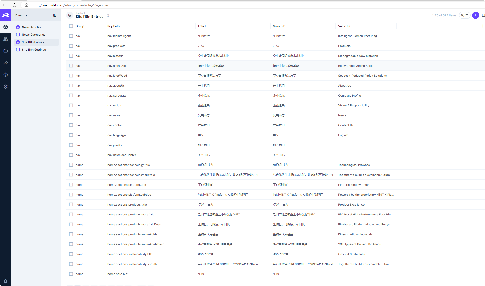

# 正文中英文对照表配置

> 面向运营和内容负责人。本文汇总官网固定文案、新闻英文内容、英文入口开关和翻译来源规则。日常修改不需要重新构建前端。

## 1. 维护入口

Directus 后台：`https://cms.mint-bio.cn`

固定文案通常在 `site_i18n_entries` 中按分组、中文说明或 key 搜索后维护：



固定文案集合：

```text
site_i18n_entries
```

语言全局配置集合：

```text
site_i18n_settings
```

## 2. 英文内容分两类

| 类型 | 维护位置 | 是否需要重新构建前端 |
|---|---|---|
| 新闻英文内容 | Directus `news_articles` 的 `_en` 字段 | 不需要 |
| 官网固定英文文案 | Directus `site_i18n_entries.value_en` | 不需要；修改后更新 `content_version` |

本地 `src/i18n/zh-CN.json` 和 `src/i18n/en-US.json` 仅作为前端紧急 fallback，不作为日常运营入口。

## 3. 固定文案字段

`site_i18n_entries` 当前有效字段：

| 字段 | 说明 |
|---|---|
| `key_path` | 程序读取用 key，例如 `nav.news`、`home.hero.title`。 |
| `group` | 分组，例如 `nav`、`footer`、`home`、`news`。 |
| `label` | 运营可读中文说明，方便搜索。 |
| `value_zh` | 中文文案。 |
| `value_en` | 英文文案；为空时前端回退中文。 |
| `enabled` | 是否启用。 |

推荐列表显示：

```text
group / label / key_path / value_zh / value_en / enabled
```

推荐排序：

```text
group, key_path
```

## 4. 全局配置字段

`site_i18n_settings` 当前只维护一条记录。

有效字段：

| 字段 | 说明 |
|---|---|
| `feature_en_enabled` | 是否显示英文入口。 |
| `content_version` | 整数版本号。修改文案或英文入口后加 `1`。 |

当前如果暂不开放英文，应保持：

```text
feature_en_enabled = false
```

## 5. 日常修改固定文案

1. 打开 `site_i18n_entries`。
2. 用 `group`、`label` 或 `key_path` 搜索目标文案。
3. 修改 `value_zh` 或已确认的 `value_en`。
4. 保存。
5. 打开 `site_i18n_settings`。
6. 将 `content_version` 加 `1`，例如从 `8` 改为 `9`。
7. 刷新官网页面验证。

如果内容改错：

1. 直接把文案改回正确内容。
2. 再将 `content_version` 加 `1`。
3. 刷新页面验证。

## 6. 新闻英文内容维护

新闻英文内容在 Directus `News Articles` 中维护：

| 字段 | 说明 |
|---|---|
| `title_en` | 英文标题。 |
| `summary_en` | 英文摘要。 |
| `content_blocks_en` | 英文正文，使用和中文正文相同的 Block Editor。 |

操作建议：

1. 先确认已有正式英文稿。
2. 找到对应新闻。
3. 填写 `title_en`、`summary_en`。
4. 在 `content_blocks_en` 中录入英文正文。
5. 保存。
6. 如英文入口已开启，到 `?lang=en` 页面验证。

英文新闻 fallback 规则：

- `title_en` 为空时显示 `title_zh`。
- `summary_en` 为空时显示 `summary_zh`。
- `content_blocks_en` 为空时显示 `content_blocks_zh`。

只发布中文新闻是允许的，不需要为了发布中文内容而补英文。

## 7. 开启或关闭英文入口

开启英文入口：

```text
feature_en_enabled = true
content_version = 当前版本号 + 1
```

关闭英文入口：

```text
feature_en_enabled = false
content_version = 当前版本号 + 1
```

刷新页面后生效。英文入口开启时：

- PC Header 显示语言切换。
- Mobile Header 显示 CN / EN 切换。
- URL `?lang=en` 生效。
- 用户语言偏好保存在 `localStorage.language`。

## 8. 前端生效规则

前端每次启动会读取 `site_i18n_settings`：

- `content_version` 没变：继续使用本地缓存的固定文案。
- `content_version` 变化：重新读取启用状态的 `site_i18n_entries`。

固定文案 fallback 顺序：

```text
Directus 当前语言
  -> Directus 中文
  -> 本地 JSON 当前语言
  -> 本地 JSON 中文
  -> key
```

`value_en` 为空时，英文模式显示中文。

## 9. 翻译来源规则

项目规则：**禁止自行翻译**。

英文内容只能来自：

1. 用户提供并确认的英文稿。
2. `doc/archive/zh-en/` 中已有的中英对照资料。
3. 其他经负责人明确确认的翻译资料。

如果某段中文没有对应英文稿：

- `value_en` 或新闻 `_en` 字段保持空值。
- 前端英文模式回退中文。
- 或等待用户提供英文。
- 不要根据上下文自行翻译。

## 10. 权限要求

前端只需要读取权限。

`site_i18n_settings` 读取字段：

```text
id, feature_en_enabled, content_version
```

`site_i18n_entries` 读取字段：

```text
key_path, group, label, value_zh, value_en, enabled
```

`site_i18n_entries` 前端读取条件：

```text
enabled = true
```

不要给公开角色开放创建、修改、删除权限。

## 11. 相关内容维护边界

- 新闻标题、摘要、正文在 Directus `news_articles` 的 `_zh` / `_en` 字段中维护。
- 新闻分类名称由 Directus `news_categories.name_zh` / `name_en` 维护，不纳入 `site_i18n_entries` 固定文案配置。
- 英文内容不得自行补译；缺失英文时保持空值并回退中文。

