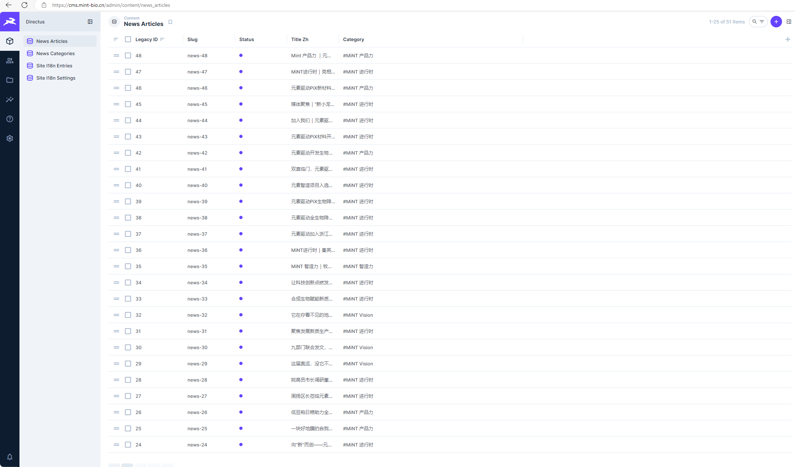

# Directus 新闻编辑器使用手册

> 面向运营人员。本文只说明官网“发展动态 / 新闻”的日常更新流程。

## 1. 后台入口与操作边界

- Directus 后台：`https://cms.mint-bio.cn`
- 常用集合：`News Articles` / `news_articles`
- 分类集合：`News Categories` / `news_categories`
- 媒体库：Directus File Library

后台中 `News Articles` 列表用于维护官网新闻：



运营日常只需要维护新闻内容和图片。不要修改：

- 数据模型 / 字段配置
- 角色权限
- API / Webhook / Flow
- Nginx / CDN / 服务器配置

## 2. 新闻字段说明

| 字段 | 是否常用 | 说明 |
|---|---:|---|
| `title_zh` | 必填 | 中文标题。 |
| `title_en` | 可选 | 英文标题，留空时英文模式回退中文标题。 |
| `summary_zh` | 可选 | 中文摘要，用于列表卡片和详情概览。 |
| `summary_en` | 可选 | 英文摘要，留空时英文模式回退中文摘要。 |
| `cover` | 必填 | 封面图，用于首页、列表、详情。 |
| `category` | 必填 | 新闻分类。 |
| `publish_at` | 必填 | 发布时间，前端按置顶和发布时间排序。 |
| `status` | 必填 | `draft` 草稿，`published` 发布。 |
| `featured` | 可选 | 是否置顶，置顶文章优先展示。 |
| `content_blocks_zh` | 必填 | 中文正文，Directus Block Editor。 |
| `content_blocks_en` | 可选 | 英文正文，留空时英文模式回退中文正文。 |
| `slug` | 必填 | URL 标识，只用小写字母、数字和连字符。 |

## 3. 新增新闻流程

1. 登录 Directus 后台。
2. 进入 `News Articles`。
3. 点击创建新文章。
4. 填写基础字段：
   - `slug`
   - `title_zh`
   - `summary_zh`
   - `category`
   - `publish_at`
   - `cover`
5. 在 `content_blocks_zh` 中编辑正文。
6. 如已有英文确认稿，可填写 `title_en`、`summary_en`、`content_blocks_en`。
7. 先保存为 `draft` 检查内容。
8. 确认无误后将 `status` 改为 `published`。
9. 到官网验证：
   - 首页新闻区
   - `/mintNews` 新闻列表
   - `/mintNews/detail/<slug>` 或旧数字链接
   - PC 和手机端

## 4. 编辑已有新闻

1. 进入 `News Articles`。
2. 搜索标题、`slug` 或旧 `legacy_id`。
3. 修改字段或正文。
4. 保存。
5. 前端新闻接口有短缓存，若前台暂未变化，可等待约 30 秒或强制刷新页面。

## 5. 下线新闻

推荐方式：把 `status` 从 `published` 改为 `draft`。

不建议运营直接删除文章。原因：

- 删除后前台无法访问。
- 误删恢复成本更高。
- 保留草稿更利于后续追溯。

如误改内容，优先检查 Directus 的 Activity / Revisions 记录。

## 6. 正文 Block Editor 使用规则

常用块：

| 块类型 | 用途 |
|---|---|
| Paragraph | 普通段落。 |
| Header | 小标题，建议使用二级或三级标题。 |
| Image | 正文图片。 |
| Quote | 引用内容。 |
| NestedList | 列表。 |
| Delimiter | 分隔线。 |
| Embed | 嵌入外部内容。 |
| Raw HTML | 原始 HTML，仅在确有必要时使用，建议由开发协助。 |

正文尽量使用普通块，不要频繁使用 Raw HTML。

## 7. 图片和媒体维护

- 封面图填在 `cover` 字段。
- 正文图片通过 Block Editor 的 Image 块插入。
- 上传文件时选择合适 folder。
- 当前不做自动默认目录，运营需要人工选择目录。
- `news/_legacy` 是历史迁移媒体目录，新内容不建议继续混放进去。

图片建议：

- 优先使用清晰、压缩合理的 jpg/png/webp。
- 封面图尽量保持横图比例。
- 图片文件名尽量使用英文、数字、连字符。

## 8. 颜色短代码

如需给段落中的部分文字设置颜色，使用短代码：

```text
[color=#e75a29]重点文字[/color]
[color=orange]重点文字[/color]
[color=blue]重点文字[/color]
[color=green]重点文字[/color]
[color=blue-green]重点文字[/color]
```

支持：

- HEX 色值，如 `#e75a29`
- 安全的 `rgb()` / `rgba()` / `hsl()` / `hsla()`
- 已定义品牌别名：`orange`、`blue`、`green`、`blue-green`

禁止：

- `url()`
- `var()`
- `expression()`
- 分号和多条 CSS 声明
- 嵌套 `[color]` 短代码

如果短代码写错，前端会尽量保留原文字，不会强行渲染为危险样式。

## 9. 英文新闻内容

英文新闻字段包括：

- `title_en`
- `summary_en`
- `content_blocks_en`

规则：

1. 英文字段可以留空。
2. 英文字段为空时，英文模式下会回退显示中文。
3. 英文内容必须来自用户确认稿或历史中英对照资料，不能自行翻译。
4. 如果只更新中文新闻，不需要为了发布而补英文。

更多规则见 [英文信息更新说明](./english-content-update.md)。

新闻分类名称由 `news_categories` 中的 `name_zh` / `name_en` 维护；它不走 `site_i18n_entries` 固定文案表。

## 10. 发布后检查清单

发布后至少检查：

- 首页新闻卡片是否出现。
- 新闻列表是否能看到新文章。
- 分类筛选是否正确。
- 新闻详情页标题、摘要、封面、正文是否正确。
- PC 和移动端是否都正常。
- 正文图片是否显示。
- 颜色短代码是否生效。
- 如有视频，视频是否可播放。
- 如补了英文，英文模式下是否展示英文；未补英文时是否正常回退中文。

## 11. 常见问题

### 发布后前台没更新

可能原因：

- 文章仍是 `draft`。
- `publish_at` 填写异常。
- 浏览器或前端短缓存未过期。
- CDN 缓存未刷新。

先等待约 30 秒并强刷页面；仍异常时联系开发/运维。

### 图片不显示

检查：

- 图片是否成功上传到 Directus。
- `cover` 是否选中了文件。
- 正文 Image 块是否引用了正确文件。
- 文件是否被误删。

### 英文内容为空

这是允许的。英文模式会回退中文。若需要正式英文展示，请提供确认后的英文稿再填写 `_en` 字段。

### 颜色短代码未生效

检查：

- 是否成对书写 `[color=...]...[/color]`。
- 色值是否安全。
- 是否嵌套了短代码。

## 12. 禁止事项

- 不要修改 Directus 字段、集合、角色、权限。
- 不要把新闻维护改回静态 JSON。
- 不要自行翻译英文内容。
- 不要在正文中粘贴未知脚本或复杂 HTML。
- 不要删除历史文章，除非已经和负责人确认。
