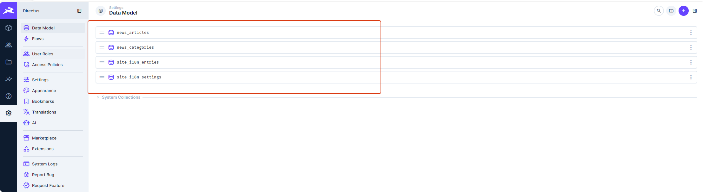

# Directus 新闻前端集成

## 1. 当前状态

新闻模块已固定为 Directus 单一数据源。

核心文件：`src/api/news.js`

`isDirectusNewsEnabled()` 当前固定返回 `true`。

## 2. API 基础配置

默认配置：

```js
const DEFAULT_DIRECTUS_URL = '/directus-api'
const DIRECTUS_URL = (process.env.VUE_APP_DIRECTUS_URL || DEFAULT_DIRECTUS_URL).replace(/\/$/, '')
const DIRECTUS_ASSET_URL = (process.env.VUE_APP_DIRECTUS_ASSET_URL || DIRECTUS_URL).replace(/\/$/, '')
```

说明：

| 配置 | 用途 |
|---|---|
| `/directus-api` | 默认同源代理，生产和本地都优先使用。 |
| `VUE_APP_DIRECTUS_URL` | 可选覆盖 Directus API 地址。 |
| `VUE_APP_DIRECTUS_ASSET_URL` | 可选覆盖 Directus asset 地址。 |

生产环境不显式配置时，前端不会直接跨域访问 `cms.mint-bio.cn`，而是走同源 `/directus-api`。

## 3. Directus 集合

| 集合 | 用途 |
|---|---|
| `news_articles` | 新闻文章。 |
| `news_categories` | 新闻分类。 |
| `directus_files` | 封面和正文图片。 |

Directus 数据模型位置可参考下图；日常运营不应在此修改集合或字段：



## 4. `news_articles` 字段

前端读取字段包括：

- `legacy_id`
- `slug`
- `title_zh`
- `title_en`
- `summary_zh`
- `summary_en`
- `cover.id`
- `cover.width`
- `cover.height`
- `cover.filesize`
- `cover.type`
- `category.slug`
- `category.name_zh`
- `category.name_en`
- `publish_at`
- `featured`
- `content_blocks_zh`
- `content_blocks_en`

## 5. 分类映射

| Directus slug | 前端 category | 中文标签 | 英文标签 | 颜色 |
|---|---|---|---|---|
| `mint-runtime` | `runtime` | `#MiNT进行时` | `#MiNT Runtime` | `#FF7200` |
| `mint-products` | `production` | `#MiNT产品力` | `#MiNT Products` | `#144BE1` |
| `mint-biomanufacturing` | `manufacture` | `#MiNT智造力` | `#MiNT Biomanufacturing` | `#7455F6` |
| `mint-vision` | `vision` | `#MiNT Vision` | `#MiNT Vision` | `#007D30` |

## 6. 列表读取

接口：

```text
GET /directus-api/items/news_articles
```

关键参数：

- `filter[status][_eq]=published`
- `sort=-featured,-publish_at`
- `fields=<LIST_FIELDS>`

分类筛选时通过 `category.slug` 过滤。

## 7. 详情读取

详情路由：

```text
/mintNews/detail/:configId
```

查找规则：

- 如果 `configId` 是数字，则按 `legacy_id` 查找。
- 否则按 `slug` 查找。

这样可以兼容旧数字链接和新 slug 链接。

## 8. EditorJS Block 映射

Directus `content_blocks_zh/en` 使用 Block Editor，数据是 EditorJS JSON。

前端 mapper 会转为旧详情组件可识别的数据结构：

| block type | 前端映射 |
|---|---|
| `image` | `pic` 或 `nopaddingpic`，`stretched=true` 时为无边距图。 |
| `paragraph` | 普通文本 `desc` 或富文本 `strongText`。 |
| `quote` | `quote`。 |
| `raw` | `richHtml`，用于历史复杂 HTML 或视频。 |

当前 mapper 未渲染所有 EditorJS 块；不识别的块会被忽略。因此运营文档中推荐使用常规块。

## 9. 图片资源和 transform

图片 URL 通过 `getAssetUrl()` 生成。

支持：

- Directus file id
- `/assets/<uuid>`
- 完整 `http(s)` URL

常用 transform：

| 场景 | 参数 |
|---|---|
| 缩略图 | `width=800&height=500&fit=cover&format=webp&quality=80` |
| 详情图 | `width=1200&format=webp&quality=85` |
| 视频 poster | `width=960&format=webp&quality=80` |

超大图或异常宽高比会跳过 transform，避免 Directus 图片处理压力过高。

## 10. 短缓存

前端对 Directus API 使用 `sessionStorage` 短缓存：

- TTL：30 秒
- key 前缀：`mintbio:directus-api:`

影响：

- 新闻发布或修改后，前台可能有短暂延迟。
- 验证时可等待约 30 秒或清理浏览器缓存。

## 11. 英文 fallback

`pickText()`：

- 英文模式：`${field}_en || ${field}_zh || ''`
- 中文模式：`${field}_zh || ${field}_en || ''`

`pickBlocks()`：

- 英文模式下，如果 `content_blocks_en.blocks` 有内容，则使用英文正文。
- 否则使用 `content_blocks_zh`。

## 12. 颜色短代码

前端在 `mapInlineTextContent()` 中调用 `renderColorShortcodes()`。

支持格式：

```text
[color=#e75a29]文字[/color]
[color=orange]文字[/color]
```

安全策略：

- 支持 HEX、受控 `rgb/rgba/hsl/hsla`、品牌别名。
- 拒绝 `url()`、`var()`、`expression()`、分号、复杂 CSS 注入。
- 无效短代码保持原样。

## 13. 视频和 Raw HTML

`raw` block 会经过 `normalizeRichHtml()`：

- 将 `https://www.mint-bio.cn/video/` 归一为 `/video/`。
- 将 Raw HTML 中的 Directus asset poster 转换为可访问 asset URL。

Raw HTML 风险较高，建议只由 Admin 或开发维护。

## 14. 排障

### 新闻列表为空

检查：

- Directus 是否可访问。
- `/directus-api/items/news_articles` 是否返回数据。
- 文章 `status` 是否为 `published`。
- Nginx `/directus-api` 代理是否正常。

### 详情 404

检查：

- 路由参数是数字还是 slug。
- Directus 中 `legacy_id` / `slug` 是否匹配。
- 文章是否 `published`。

### 图片不显示

检查：

- `cover` 是否存在。
- `directus_files` 文件是否存在。
- `/directus-api/assets/<uuid>` 是否可访问。
- CDN 是否缓存了异常响应。

### 英文没有显示

检查：

- Directus `site_i18n_settings.feature_en_enabled` 是否开启。
- 是否已更新 `site_i18n_settings.content_version` 并刷新页面。
- 当前 URL 是否带 `?lang=en`。
- Directus 新闻 `_en` 字段是否填写。
- 未填写时回退中文是预期行为。

注意：新闻分类名称由 `news_categories.name_zh` / `name_en` 提供，不纳入 `site_i18n_entries` 固定文案运行时配置。
